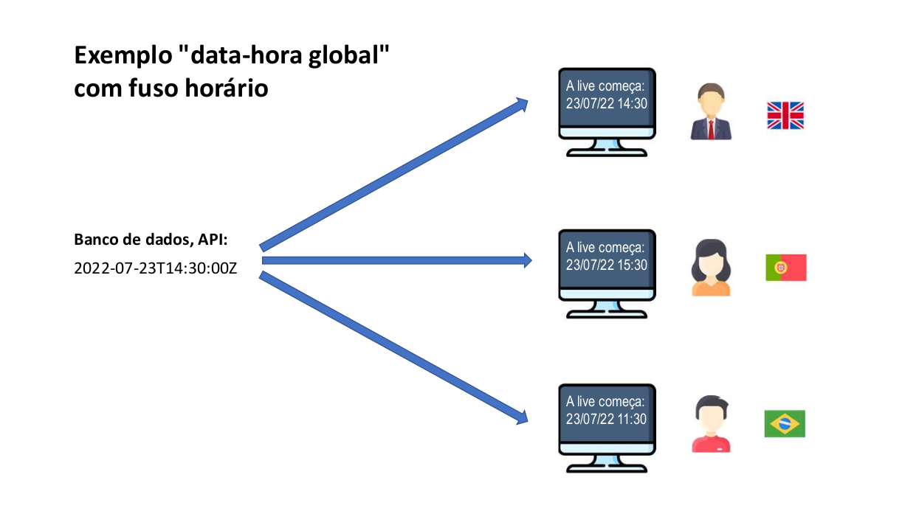

# Tópicos especiais em Java: Data-Hora

## Conceitos importantes
1. **Data-[hora] local:**
    1. ano-mês-dia-[hora] **sem fuso horário**
    2. [hora] opcional
2. Data-hora global
    1. ano-mês-dia-hora **com fuso horário**
3. Duração:
    1. tempo decorrido entre duas data-horas


### Representação de uma data-hora global


Na imagem acima temos a diferença entre as horas em diferentes países. O resultado de
```text
2022-07-23T14:30:00Z
```
O Z no final representa o horário em londres. Por fim, temos o cálculo do sistema local, onde irá exibir a hora em
cada país.

## Quando usar?
1. Data-[hora] local:
    1. Quando o **momento exato não interessa a pessoa de outro fuso horário.**
    2. Uso comum: sistemas de região única, Excel.
        1. Data de nascimento: "15/06/2001"
        2. Data-hora da venda: "13/08/2022" às 15:32" (presumindo não interessar o fuso horário)
2. Data-hora global:
    1. Quando o **momento exato interessa a pessoa de outro fuso horário.**
    2. Uso comum: sistemas multi-região, web.
        1. Quando será o sorteio? "21/08/2022 às 20h (horário de São Paulo)"
        2. Quando o comentário foi postado? "há 17 minutos"
        3. Quando foi realizada a venda? "13/08/2022 às 15:32 (horario de São Paulo)"
        4. Início e fim do evento? "21/08/2022 às 14h até 16h (horário de São Paulo)"


## Timezone (fuso horário)
1. **GMT - Greenwich Mean Time**
    1. **Horário de Londres**
    2. **Horário do padrão UTC - Coordinated Universal Time**
    3. **Também chamado de "Z" time, ou Zulu time**
2. **Outros fusos horários são relativos ao GMT/UTC:**
    1. **São Paulo: GMT-3**
    2. **Manaus: GMT-4**
    3. **Portugal: GMT+1**
3. **Muitas linguagens/tecnologias usam nomes para as timezones:**
    1. **"US/Pacific"**
    2. **"America/Sao_Paulo"**
    3. **etc.**

## Padrão ISO 8601
Padrão de horas em texto.

1. **Data-[hora] local:**
    1. 2022-07-21
    2. 2022-07-21T14:52
    3. 2022-07-21T14:52:09
    4. 2022-07-21T14:52:09.4073
2. **Data-hora global:**
    1. 2022-07-23T14:52:09Z
    2. 2022-07-23T14:52:09.254935Z
    3. 2022-07-23T14:52:09-03:00


## Operações importantes com data-hora
1. Instanciação
    1. (agora) -> Data-hora
    2. Texto ISO 8601 -> Data-hora
    3. Texto foramto customizado -> Data-hora
    4. dia, mês, ano, [horário] -> Data-hora local
2. Formatação
    1. Data-hora -> Texto ISO 8601
    2. Data-hora -> Texto formato customizado
3. Obter dados de uma data-hora local
    1. Data-hora local -> dia, mês, ano, horário
4. Converter data-hora global para local
    1. Data-hora global, timezone (sistema local) -> Data-hora local
5. Cálculos com data-hora
    1. Data-hora +/- tempo -> Data-hora
    2. Data-hora 1, Data-hora 2 -> Duração

## Principais tipos Java (versão 8+)

### Usamos LocalDate e LocalDateTime quando não precisamos do fuso horário.
1. Data-hora local
    1. LocalDate
    2. LocalDateTime
### Usamos Instant quando precisamos do instante no tempo, além do fuso horário.
2. Data-hora global
    1. Instant
3. Duração
    1. Duration
4. Outros
    1. ZoneId
    2. ChronoUnit

## Operações importantes com data-hora
1. Instaciação
    1. (agora) -> Data-hora
    2. Texto ISO 8601 -> Data-hora
    3. Texto formato customizado -> Data-hora
    4. dia, mês, ano, [horário] -> Data-hora local
2. Formatação
    1. Data-hora -> Texto ISO 8601
    2. Data-hora -> Texto formato customizado

## Exemplos usando as classes LocalDate, LocalDateTime, Instant e DateTimeFormatter

```java
package app;

import java.time.Instant;
import java.time.LocalDate;
import java.time.LocalDateTime;
import java.time.format.DateTimeFormatter;

public class Program {
    public static void main(String[] args) {
        // Pega a data local do sistema.
        LocalDate d01 = LocalDate.now();
        // Exibe o resultado
        System.out.println("d01 = " + d01);

        // Pega a data e hora local do sistema
        LocalDateTime d02 = LocalDateTime.now();
        // Exibe o resultado
        System.out.println("d02 = " + d02);
        // Pega a data hora no padrão GMT(horario de londres, Z time)

        Instant d03 = Instant.now();
        // Exibe o resultado
        System.out.println("d03 = " + d03);

        // Representa uma data no formato ISO 8601
        LocalDate d04 = LocalDate.parse("2023-02-16");
        System.out.println("d04 = " + d04);

        // Representa uma data-hora no formato ISO 8601
        LocalDateTime d05 = LocalDateTime.parse("2023-02-16T22:30:45");
        System.out.println("d05 = " + d05);

        // Exibe uma data hora global no padrão Z time
        Instant d06 = Instant.parse("2023-02-16T22:30:45Z");
        System.out.println("d06 = " + d06);

        // Formata a saída de uma data
        DateTimeFormatter fmt1 = DateTimeFormatter.ofPattern("dd/MM/yyyy");

        // Passamos a data formatada com a variável fmt1 que formata a saída
        LocalDate d07 = LocalDate.parse("16/02/2023", fmt1);
        // Exibe o resultado
        System.out.println("d07 = " + d07);

        // Formata o dia, mês, ano e hora
        DateTimeFormatter fmt2 = DateTimeFormatter.ofPattern("dd/MM/yyyy HH:mm");
        // Formata a hora local para uma hora passada com o argumento fmt2.
        LocalDateTime d08 = LocalDateTime.parse("16/02/2023 22:30", fmt2);
        // Exibe o resultado
        System.out.println("d08 = " + d08);
    }
}
```

#### Em resumo:
1. Usamos LocalDate quando queremos a data local
2. Usamos LocalDateTime quando queremos a data e a hora local
3. Usamos Instant quando queremos a data e hora global(GMT, horário de londres "Z Time ou Zulu Time")
4. Usamos DateTimeFormatter para formatar a saída de uma data.


### Convertendo data-hora para texto personalizado
Abaixo temos alguns métodos de transformar uma data-hora para um texto personalizado

```java
package app;

import java.time.Instant;
import java.time.LocalDate;
import java.time.LocalDateTime;
import java.time.ZoneId;
import java.time.format.DateTimeFormatter;

public class Program {
    public static void main(String[] args) {
        LocalDate d04 = LocalDate.parse("2023-02-16");
        LocalDateTime d05 = LocalDateTime.parse("2023-02-16T22:30:25");
        Instant d06 = Instant.parse("2023-02-16T22:30:25Z");

        // Formata a saída para dia mês ano
        DateTimeFormatter fmt1 = DateTimeFormatter.ofPattern("dd/MM/yyyy");
        DateTimeFormatter fmt2 = DateTimeFormatter.ofPattern("dd/MM/yyyy HH:mm");
        // O método withZone procura a zona horária do usuário, ja o zoneId com o método systemDefault pega a zona padrão do usuário.
        DateTimeFormatter fmt3 = DateTimeFormatter.ofPattern("dd/MM/yyyy HH:mm").withZone(ZoneId.systemDefault());
        // Método format recebe um objeto que formata a saída de uma data-hora
        System.out.println("d04 = " + d04.format(fmt1));
        System.out.println("d05 = " + d05.format(fmt2));
        // Invertemos a ordem pois Instant não possui o método format
        System.out.println("d06 = " + fmt3.format(d06));
    }
}
```

### Convertendo data-hora global para data-hora local

1. Converter data-hora global para local
   1. Data-hora global, timezone(sistema local) -> Data-hora local
2. Obter dados de uma data-hora local
   1. Data-hora local -> dia, mês, ano, horário
3. Cálculos com data-hora
   1. Data-hora +/- tempo -> Data-hora
   2. Data-hora 1, Data-hora 2 -> Duração

```java
package app;

import java.time.Instant;
import java.time.LocalDate;
import java.time.LocalDateTime;
import java.time.ZoneId;

public class Program {
    public static void main(String[] args) {
        // NOTA: PARA TRANSFORMAR DATA-HORA GLOBAL PARA LOCAL, É NECESSÁRIO INFORMAR
        // O TIMEZONE.
        LocalDate d04 = LocalDate.parse("2022-07-20");
        LocalDateTime d05 = LocalDateTime.parse("2022-07-20T01:30:26");
        Instant d06 = Instant.parse("2022-07-20T01:30:26Z");

        // Converte uma data-hora global para uma data-hora local considerando o timezone da máquina.
        LocalDate r1 = LocalDate.ofInstant(d06, ZoneId.systemDefault());
        // Horário local de portugal
        LocalDate r2 = LocalDate.ofInstant(d06, ZoneId.of("Portugal"));
        // Pega a data-hora local do sistema em relação a um fuso horário
        LocalDateTime r3 = LocalDateTime.ofInstant(d06, ZoneId.systemDefault());
        // Pega a data-hora local do sistema em relação a um fuso horário
        LocalDateTime r4 = LocalDateTime.ofInstant(d06, ZoneId.of("Portugal"));

        System.out.println("r1 = " + r1);
        System.out.println("r2 = " + r2);
        System.out.println("r3 = " + r3);
        System.out.println("r4 = " + r4);

        // Pegando o dia, mês e ano de uma data-local
        System.out.println("d04 dia = " + d04.getDayOfMonth());
        System.out.println("d04 mês = " + d04.getMonthValue());
        System.out.println("d04 ano = " + d04.getYear());

        System.out.println("d05 hora = " + d05.getHour());
        System.out.println("d05 minutos  = " + d05.getMinute());
        System.out.println("d05 segundos = " + d05.getSecond());
    }
}
```

No exemplo acima usamos o método ofInstant para converter data-hora global para local. Note que usamos a 
classe zoneID e os métodos systemDefault para pegar o timezone local e o método .of para pegar um timezone como 
argumento. Por fim usamos os métodos get dos objetos d04 e d05 que são autoexplicativos.

### Cálculos com data-hora

O exemplo abaixo é autoexplicativo.

```java
package app;

import java.time.*;
import java.time.temporal.ChronoUnit;

public class Program {
    public static void main(String[] args) {
        // NOTA: PARA TRANSFORMAR DATA-HORA GLOBAL PARA LOCAL, É NECESSÁRIO INFORMAR
        // O TIMEZONE.
        LocalDate d04 = LocalDate.parse("2022-07-20");
        LocalDateTime d05 = LocalDateTime.parse("2022-07-20T01:30:26");
        Instant d06 = Instant.parse("2022-07-20T01:30:26Z");

        // Usamos o objeto d04 com o método minusDay que subtrai os dias passados por argumento
        LocalDate pastWeekLocalDate = d04.minusDays(7);
        // Armazena o valor do objeto d04 + 7 dias
        LocalDate nextWeekLocal = d04.plusDays(7);

        System.out.println("pastWeekLocalDate = " + pastWeekLocalDate);
        System.out.println("nextWeekLocal = " + nextWeekLocal);

        // Adiciona/subtrai as datas + hora.
        LocalDateTime pastWeekLocalDateTime = d05.minusDays(7);
        LocalDateTime nextWeekLocalDateTime = d05.plusDays(7);

        System.out.println("pastWeekLocalDateTime = " + pastWeekLocalDateTime);
        System.out.println("nextWeekLocalDateTime = " + nextWeekLocalDateTime);

        // Usamos o método minus e plus seguido da classe ChronoUnit e a constante DAYS.
        Instant pastWeekInstant = d06.minus(7, ChronoUnit.DAYS);
        Instant nextWeekInstant = d06.plus(7, ChronoUnit.DAYS);

        System.out.println("pastWeekInstant = " + pastWeekInstant);
        System.out.println("nextWeekInstant = " + nextWeekInstant);

        // Usamos a classe duration para saber a duração entre duas data-horas
        // com o método between que recebe dois parametros.
        Duration t1 = Duration.between(pastWeekLocalDateTime, d05);
        // Exibe o resultado da diferença em dias
        System.out.println("t1 = " + t1.toDays());

        // Método atStartOfDay converte de LocalDate para LocalDateTime quando der meia noite
        Duration t2 = Duration.between(pastWeekLocalDate.atStartOfDay(), d04.atStartOfDay());
        System.out.println("t2 = " + t2.toDays());

        Duration t3 = Duration.between(pastWeekInstant, d06);
        System.out.println("t3 = " + t3.toDays());
    }
}
```

[Voltar](../README.md)