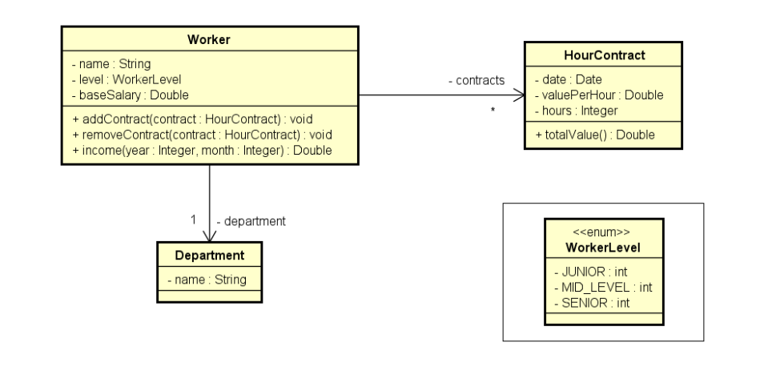
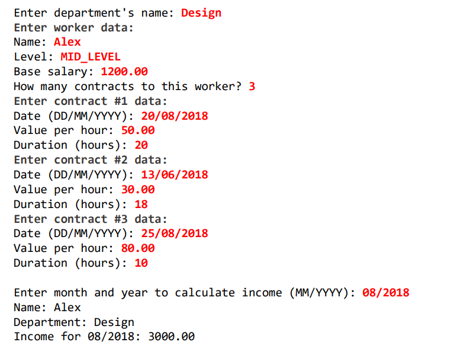

# Enumerações e Composição

1. É um tipo especial que serve para especificar de forma literal um conjunto de constantes relacionadas
2. Palavra chave em Java: enum
3. Vantagem: melhor semântica, código mais legíviel e auxiliado pelo compilador

## Exemplo de uso de Enum

1. Pacote entities.enums que possui um enum chamado OrderStatus

````java
// Pacote
package entities.enums;

// Tipo enum
public enum OrderStatus {
    // Constantes relacionadas
    PENDING_PAYMENT,
    PROCESSING,
    SHIPPED,
    DELIVERED
}
````

2. Classe Order que é responsável pelo pedido
````java
// Pacote raiz
package entities;
// Pacote onde o enum se encontra
import entities.enums.OrderStatus;
// Necessário para usar a classe Date
import java.util.Date;

public class Order {
    // Atributos
    private Integer id;
    private Date moment;
    // "Instanciamos" o enum e colocamos a referência na variável status
    private OrderStatus status;

    // Construtor vazio
    public Order() {

    }
    
    // Construtor que inicializa todos os atributos
    public Order(Integer id, Date moment, OrderStatus status) {
        this.id = id;
        this.moment = moment;
        this.status = status;
    }

    // getters e setters
    public Integer getId() {
        return id;
    }

    public void setId(Integer id) {
        this.id = id;
    }

    public Date getMoment() {
        return moment;
    }

    public void setMoment(Date moment) {
        this.moment = moment;
    }

    public OrderStatus getStatus() {
        return status;
    }

    public void setStatus(OrderStatus status) {
        this.status = status;
    }

    // Retorna o resultado dos atributos
    @Override
    public String toString() {
        return "Order{" +
                "id=" + id +
                ", moment=" + moment +
                ", status=" + status +
                '}';
    }
}
````

3. Classe AppOrder que instancia um objeto da classe Order

````java
package application;

import entities.Order;
import entities.enums.OrderStatus;

import java.util.Date;

public class AppOrder {
    public static void main(String[] args) {
        // Instaciamos um objeto da classe Order e inicializamos usando o construtor
        Order order = new Order(1080, new Date(), OrderStatus.PENDING_PAYMENT);
        
        // Exibe o resultado formatado
        System.out.println(order);
    }
}
````

## Conversão de String para enum

````java
package application;

import entities.Order;
import entities.enums.OrderStatus;

import java.util.Date;

public class AppOrder {
    public static void main(String[] args) {
        Order order = new Order(1080, new Date(), OrderStatus.PENDING_PAYMENT);

        System.out.println(order);

        // Instancia de um objeto do tipo OrderStatus com valor DELIVERED setado
        OrderStatus os1 = OrderStatus.DELIVERED;
        // O método valueOf transforma uma String em um enum
        OrderStatus os2 = OrderStatus.valueOf("DELIVERED");

        System.out.println(os1);
        System.out.println(os2);
    }
}
````

## Notação UML

1. Cada constante do tipo enum é enumerada a partir do 0


## Um pouco sobre design

#### Categorias de classes

1. Em um sistema orientado a objetos, de modo geral "tudo" é objeto.
2. **Por questões de design tais como organização, flexibilidade, reuso, delegação, etc., há várias categorias de 
   classes:**


Em resumo, uma view é basicamente a interface(tela), já o controller é responsável pela conectividade entre a tela e 
o sistema. Além disso, temos as entities de negócio(como clientes, pedidos etc.), temos classes que representam 
services e repositories(nesse caso é responsável por acessar dados de um banco de dados, por exemplo.)


Acima temos um diagrama que representa entidades, como é o caso da classe Order que possui relação com as classes 
OrderItem, Product e Client. Ou seja, são várias entidades de negócio associadas entre sí.

Um outro exemplo de classes é o caso da classe Services


No exemplo acima temos um serviço de save(salvar) e outro de search(pesquisar) pedidos. Esse tipo de serviço pode 
estar associado a um repositório de pedidos que pode fazer operações envolvendo banco de dados(CrudRepository). Além 
disso, esse serviço de OrderService está associado a um serviço de email(EmailService) que está associado a um 
serviço de autenticação(AuthService). Ou seja, esses serviços estão associados entre sí.

## Composição

1. **É um tipo de associação que permite que um objeto contenha outro**
2. **Relação "tem-um" ou "tem-vários"**
3. Vantagens
   1. Organização: divisão de responsabilidade
   2. Coesão(cada objeto é responsável por uma coisa)
   3. Flexibilidade
   4. Reuso
4. NOTA: Embora o símbolo UML para composição(toda-parte) seja o diamante preto, neste contexto estamos chamando de 
   composição qualquer associação tipo "tem-um" e "tem-vários".

Abaixo temos uma foto que retrata a nota acima


Note que a classe Order tem uma seta que possui um diamante preto e um asterístico, essa seta indica uma relação de 
composição(uma Order contém vários OrderItem).

NOTA: A classe que estiver com o símbolo de diamante preto é a classe que representa o "todo", já o outro lado é o 
lado das "partes". Chamamos isso de associação de composição. No caso da classe Client temos uma composição de 
objetos mais simples, note que não usamos o diamante preto nesse caso.

Além disso, a composição pode ocorrer com Services(serviços) como visto no diagrama abaixo


No exemplo acima também temos uma forma de composição.

### Exercício

Ler os dados de um trabalhador com N contratos (N fornecido pelo usuário). Depois, solicitar
do usuário um mês e mostrar qual foi o salário do funcionário nesse mês, conforme exemplo
(próxima página).




Resolução do exercício:

1. Criamos um enum chamado WorkerLevel que está dentro de um subpackage(enums) do package entities

````java
package entities.enums;

public enum WorkerLevel {
    JUNIOR,
    MID_LEVEL,
    SENIOR
}
````

2. Criamos uma classe chamada HourContract que faz parte do package entities

````java
package entities;

import java.util.Date;

public class HourContract {

    private Date date;
    private Double valuePerHour;
    private Integer hours;

    public HourContract() {
    }

    public HourContract(Date date, Double valuePerHour, Integer hours) {
        this.date = date;
        this.valuePerHour = valuePerHour;
        this.hours = hours;
    }

    public Date getDate() {
        return date;
    }

    public void setDate(Date date) {
        this.date = date;
    }

    public Double getValuePerHour() {
        return valuePerHour;
    }

    public void setValuePerHour(Double valuePerHour) {
        this.valuePerHour = valuePerHour;
    }

    public Integer getHours() {
        return hours;
    }

    public void setHours(Integer hours) {
        this.hours = hours;
    }

    public double totalValue() {
        return valuePerHour * hours;
    }
}
````

3. Criamos uma classe chamada Department que faz parte do package entities

````java
package entities;

public class Department {

    private String name;

    public Department() {
    }

    public Department(String name) {
        this.name = name;
    }

    public String getName() {
        return name;
    }

    public void setName(String name) {
        this.name = name;
    }
}
````

4. Em seguida criamos a classe Worker que irá realizar a composição com essas outras classes, a classe Worker faz 
   parte do package entities

````java
package entities;

import java.util.ArrayList;
import java.util.Calendar;
import java.util.List;

import entities.enums.WorkerLevel;

public class Worker {

    private String name;
    private WorkerLevel level;
    private Double baseSalary;

    private Department department;
    private List<HourContract> contracts = new ArrayList<>();

    public Worker() {
    }

    public Worker(String name, WorkerLevel level, Double baseSalary, Department department) {
        this.name = name;
        this.level = level;
        this.baseSalary = baseSalary;
        this.department = department;
    }

    public String getName() {
        return name;
    }

    public void setName(String name) {
        this.name = name;
    }

    public WorkerLevel getLevel() {
        return level;
    }

    public void setLevel(WorkerLevel level) {
        this.level = level;
    }

    public Double getBaseSalary() {
        return baseSalary;
    }

    public void setBaseSalary(Double baseSalary) {
        this.baseSalary = baseSalary;
    }

    public Department getDepartment() {
        return department;
    }

    public void setDepartment(Department department) {
        this.department = department;
    }

    public List<HourContract> getContracts() {
        return contracts;
    }

    public void addContract(HourContract contract) {
        contracts.add(contract);
    }

    public void removeContract(HourContract contract) {
        contracts.remove(contract);
    }

    public double income(int year, int month) {
        double sum = baseSalary;
        Calendar cal = Calendar.getInstance();
        for (HourContract c : contracts) {
            cal.setTime(c.getDate());
            int c_year = cal.get(Calendar.YEAR);
            int c_month = 1 + cal.get(Calendar.MONTH);
            if (year == c_year && month == c_month) {
                sum += c.totalValue();
            }
        }
        return sum;
    }
}
````

5. Por fim, criamos a classe WorkerProgram que irá realizar a implementação de tudo

````java
package application;

import java.text.ParseException;
import java.text.SimpleDateFormat;
import java.util.Date;
import java.util.Locale;
import java.util.Scanner;

import entities.Department;
import entities.HourContract;
import entities.Worker;
import entities.enums.WorkerLevel;

public class WorkerProgram {

    public static void main(String[] args) throws ParseException {

        Locale.setDefault(Locale.US);
        Scanner sc = new Scanner(System.in);
        SimpleDateFormat sdf = new SimpleDateFormat("dd/MM/yyyy");

        System.out.print("Enter department's name: ");
        String departmentName = sc.nextLine();
        System.out.println("Enter worker data:");
        System.out.print("Name: ");
        String workerName = sc.nextLine();
        System.out.print("Level: ");
        String workerLevel = sc.nextLine();
        System.out.print("Base salary: ");
        double baseSalary = sc.nextDouble();
        Worker worker = new Worker(workerName, WorkerLevel.valueOf(workerLevel), baseSalary, new Department(departmentName));

        System.out.print("How many contracts to this worker? ");
        int n = sc.nextInt();

        for (int i=1; i<=n; i++) {
            System.out.println("Enter contract #" + i + " data:");
            System.out.print("Date (DD/MM/YYYY): ");
            Date contractDate = sdf.parse(sc.next());
            System.out.print("Value per hour: ");
            double valuePerHour = sc.nextDouble();
            System.out.print("Duration (hours): ");
            int hours = sc.nextInt();
            HourContract contract = new HourContract(contractDate, valuePerHour, hours);
            worker.addContract(contract);
        }

        System.out.println();
        System.out.print("Enter month and year to calculate income (MM/YYYY): ");
        String monthAndYear = sc.next();
        int month = Integer.parseInt(monthAndYear.substring(0, 2));
        int year = Integer.parseInt(monthAndYear.substring(3));
        System.out.println("Name: " + worker.getName());
        System.out.println("Department: " + worker.getDepartment().getName());
        System.out.println("Income for " + monthAndYear + ": " + String.format("%.2f", worker.income(year, month)));

        sc.close();
    }
}
````

### Detalhando o uso de composição no exercício acima

Note que na classe Worker, nós usamos o enum WorkerLevel e usamos a classe Department, dessa forma estamos fazendo 
uso da composição. Note também que estamos fazendo uso de uma lista(ArrayList) com a classe HourContract, tudo isso 
dentro da classe Worker. Ou seja, temos uma relação de todo(Worker) e partes (HourContract e Department).