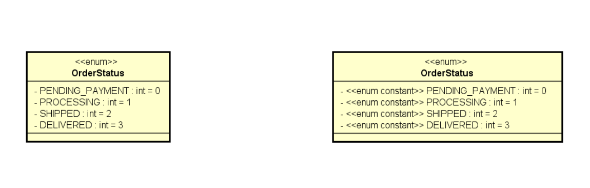
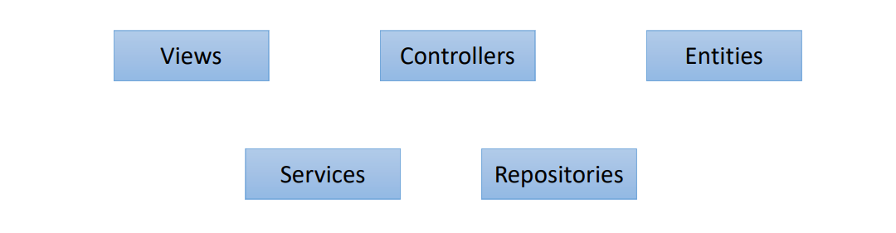
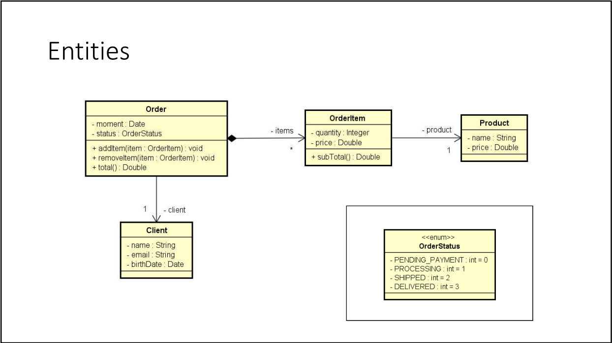
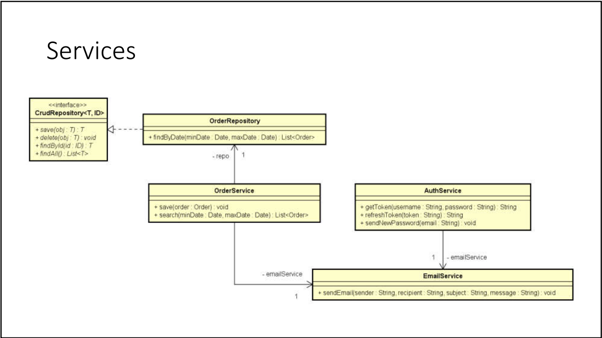

# Enumerações e Composição

1. É um tipo especial que serve para especificar de forma literal um conjunto de constantes relacionadas
2. Palavra chave em Java: enum
3. Vantagem: melhor semântica, código mais legíviel e auxiliado pelo compilador

## Exemplo de uso de Enum

1. Pacote entities.enums que possui um enum chamado OrderStatus

````java
// Pacote
package entities.enums;

// Tipo enum
public enum OrderStatus {
    // Constantes relacionadas
    PENDING_PAYMENT,
    PROCESSING,
    SHIPPED,
    DELIVERED
}
````

2. Classe Order que é responsável pelo pedido
````java
// Pacote raiz
package entities;
// Pacote onde o enum se encontra
import entities.enums.OrderStatus;
// Necessário para usar a classe Date
import java.util.Date;

public class Order {
    // Atributos
    private Integer id;
    private Date moment;
    // "Instanciamos" o enum e colocamos a referência na variável status
    private OrderStatus status;

    // Construtor vazio
    public Order() {

    }
    
    // Construtor que inicializa todos os atributos
    public Order(Integer id, Date moment, OrderStatus status) {
        this.id = id;
        this.moment = moment;
        this.status = status;
    }

    // getters e setters
    public Integer getId() {
        return id;
    }

    public void setId(Integer id) {
        this.id = id;
    }

    public Date getMoment() {
        return moment;
    }

    public void setMoment(Date moment) {
        this.moment = moment;
    }

    public OrderStatus getStatus() {
        return status;
    }

    public void setStatus(OrderStatus status) {
        this.status = status;
    }

    // Retorna o resultado dos atributos
    @Override
    public String toString() {
        return "Order{" +
                "id=" + id +
                ", moment=" + moment +
                ", status=" + status +
                '}';
    }
}
````

3. Classe AppOrder que instancia um objeto da classe Order

````java
package application;

import entities.Order;
import entities.enums.OrderStatus;

import java.util.Date;

public class AppOrder {
    public static void main(String[] args) {
        // Instaciamos um objeto da classe Order e inicializamos usando o construtor
        Order order = new Order(1080, new Date(), OrderStatus.PENDING_PAYMENT);
        
        // Exibe o resultado formatado
        System.out.println(order);
    }
}
````

## Conversão de String para enum

````java
package application;

import entities.Order;
import entities.enums.OrderStatus;

import java.util.Date;

public class AppOrder {
    public static void main(String[] args) {
        Order order = new Order(1080, new Date(), OrderStatus.PENDING_PAYMENT);

        System.out.println(order);

        // Instancia de um objeto do tipo OrderStatus com valor DELIVERED setado
        OrderStatus os1 = OrderStatus.DELIVERED;
        // O método valueOf transforma uma String em um enum
        OrderStatus os2 = OrderStatus.valueOf("DELIVERED");

        System.out.println(os1);
        System.out.println(os2);
    }
}
````

## Notação UML

1. Cada constante do tipo enum é enumerada a partir do 0



## Um pouco sobre design

#### Categorias de classes

1. Em um sistema orientado a objetos, de modo geral "tudo" é objeto.
2. **Por questões de design tais como organização, flexibilidade, reuso, delegação, etc., há várias categorias de 
   classes:**


Em resumo, uma view é basicamente a interface(tela), já o controller é responsável pela conectividade entre a tela e 
o sistema. Além disso, temos as entities de negócio(como clientes, pedidos etc.), temos classes que representam 
services e repositories(nesse caso é responsável por acessar dados de um banco de dados, por exemplo.)



Acima temos um diagrama que representa entidades, como é o caso da classe Order que possui relação com as classes 
OrderItem, Product e Client. Ou seja, são várias entidades de negócio associadas entre sí.

Um outro exemplo de classes é o caso da classe Services



No exemplo acima temos um serviço de save(salvar) e outro de search(pesquisar) pedidos. Esse tipo de serviço pode 
estar associado a um repositório de pedidos que pode fazer operações envolvendo banco de dados(CrudRepository). Além 
disso, esse serviço de OrderService está associado a um serviço de email(EmailService) que está associado a um 
serviço de autenticação(AuthService). Ou seja, esses serviços estão associados entre sí.

## Composição

1. **É um tipo de associação que permite que um objeto contenha outro**
2. **Relação "tem-um" ou "tem-vários"**
3. Vantagens
   1. Organização: divisão de responsabilidade
   2. Coesão(cada objeto é responsável por uma coisa)
   3. Flexibilidade
   4. Reuso
4. NOTA: Embora o símbolo UML para composição(toda-parte) seja o diamante preto, neste contexto estamos chamando de 
   composição qualquer associação tipo "tem-um" e "tem-vários".

Abaixo temos uma foto que retrata a nota acima


Note que a classe Order tem uma seta que possui um diamante preto e um asterístico, essa seta indica uma relação de 
composição(uma Order contém vários OrderItem).

NOTA: A classe que estiver com o símbolo de diamante preto é a classe que representa o "todo", já o outro lado é o 
lado das "partes". Chamamos isso de associação de composição. No caso da classe Client temos uma composição de 
objetos mais simples, note que não usamos o diamante preto nesse caso.

Além disso, a composição pode ocorrer com Services(serviços) como visto no diagrama abaixo


No exemplo acima também temos uma forma de composição.