# Herança e Polimorfismo

## Herança

1. É um tipo de associação que permite que uma classe herde todos dados e comportamentos de outra
2. Definições importantes
3. Vantagens
    1. Reuso
   2. Polimorfismo
4. Sintaxe
    1. class A extends B

    
#### Exemplo

Suponha um negócio de banco que possui uma conta comum e uma conta para
empresas, sendo que a conta para empresa possui todos membros da conta
comum, mais um limite de empréstimo e uma operação de realizar empréstimo.

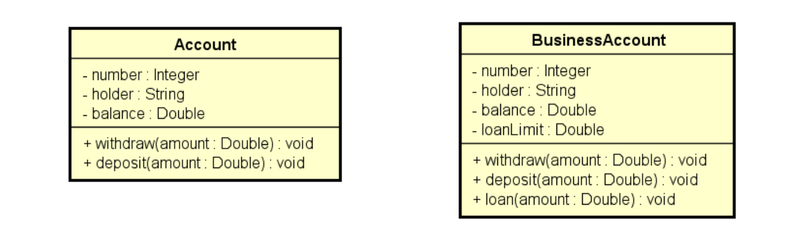

#### A herança é representada da seguinte forma na UML

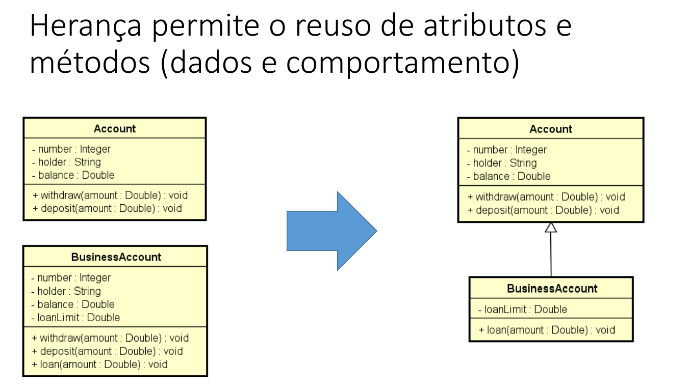

A seta que liga a classe BusinessAccount herda todos os dados e comportamentos da classe Account. Além disso, a 
classe BusinessAccount possui seus próprios métodos e atributos.

#### Classe Account

````java
package newentities;

public class Account {
    private Integer number;
    private String holder;
    // protected permite o uso em subclasses de packages diferentes
    protected Double balance;

    public Account() {

    }

    public Account(Integer number, String holder, Double balance) {
        this.number = number;
        this.holder = holder;
        this.balance = balance;
    }

    public Integer getNumber() {
        return number;
    }

    public void setNumber(Integer number) {
        this.number = number;
    }

    public String getHolder() {
        return holder;
    }

    public void setHolder(String holder) {
        this.holder = holder;
    }

    public Double getBalance() {
        return balance;
    }

    // Proibido fazer o setBalance manualmente
//    public void setBalance(Double balance) {
//        this.balance = balance;
//    }

    // Saque
    public void withdraw(Double amount) {
        balance -= amount;
    }

    // Deposito
    public void deposit(Double amount) {
        balance += amount;
    }
}
````

#### Classe BusinessAccount

````java
package newentities;

// A classe BusinessAccount herda todos os dados e comportamentos da classe Account
public class BusinessAccount extends Account {
    private Double loanLimit;

    public BusinessAccount() {

    }

    // Reaproveitamos o construtor da classe Account
    public BusinessAccount(Integer number, String holder, Double balance, Double loanLimit) {
        // Super serve para "chamar" o construtor da super classe(Account)
        super(number, holder, balance);
        this.loanLimit = loanLimit;
    }

    public Double getLoanLimit() {
        return loanLimit;
    }

    public void setLoanLimit(Double loanLimit) {
        this.loanLimit = loanLimit;
    }

    public void loan(double amount) {
        if (amount <= loanLimit) {
            // balance tem visibilidade protected
            balance += amount - 10.0;
        }
    }
}
````

No exemplo acima usamos o modificador de acesso protected na classe Account com o atributo balance, dessa forma 
permitimos que o atributo balance seja acessado por subclasses do mesmo pacote ou em pacotes diferentes.

## Definições importantes
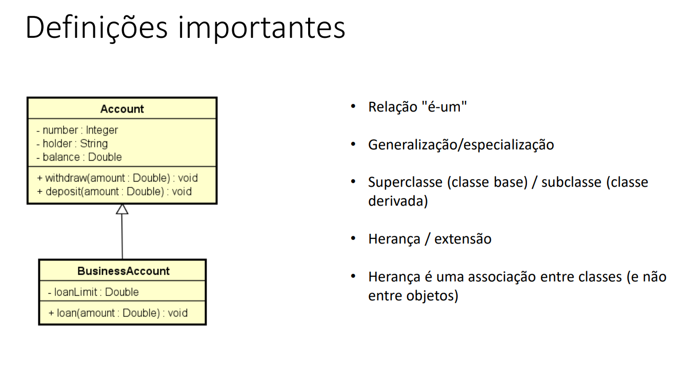

1. Relação "é-um"
   1. Significa dizer que a classe BusinessAccount é uma Account pois tem tudo que a classe Account tem só que com 
      algumas modificações.
2. Generalização/Especialização
   1. A classe Account é chamada de Generalização, pois é o tipo mais generico que temos. A classe BusinessAccount é 
      uma especialização da classe Account.
3. Superclasse(classe base ou classe mãe) Subclasse(classe derivada ou classe filha)
4. Herança é uma associação entre classes(e não entre objetos).

## Upcasting e Downcasting

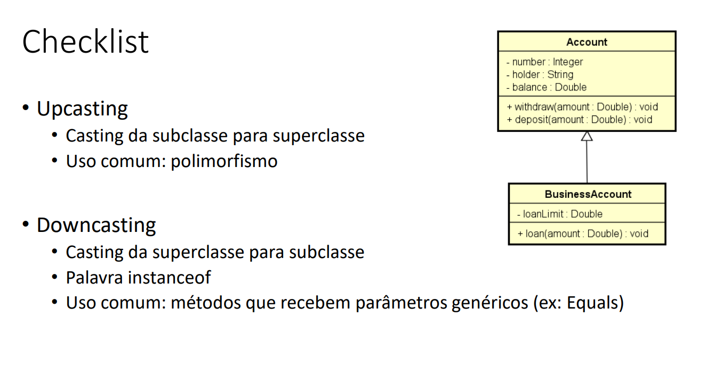

### Exemplo do uso de Upcasting e Downcasting
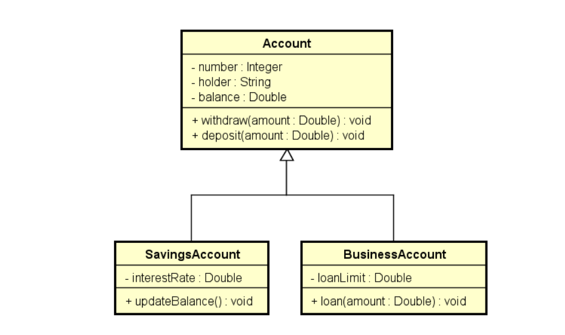

````java
package newapplication;

import newentities.Account;
import newentities.BusinessAccount;
import newentities.SavingsAccount;

public class Program {
    public static void main(String[] args) {
        Account acc = new Account(1001, "Douglas", 0.0);
        BusinessAccount bacc = new BusinessAccount(1002, "Maria", 0.0, 500.0);

        // UPCASTING

        // Uma BusinessAccount é uma Account, logo podemos atribuir a subclasse à superclasse.
        Account acc1 = bacc;

        // Outro exemplo
        // Como uma BusinessAccount é uma Account, podemos realizar um upcasting na BusinessAccount.
        Account acc2 = new BusinessAccount(1003, "Bob", 0.0, 200.0);
        Account acc3 = new SavingsAccount(1004, "Anna", 0.0, 0.01);

        // DOWNCASTING

        // É necessário fazer o casting para realizar o downcasting.
        BusinessAccount acc4 = (BusinessAccount) acc2;

        // Analisa se o objeto acc3 é uma instância da classe BusinessAccount
        // Como acc3 não é uma instância de BusinessAccount, não será executado.
        if (acc3 instanceof BusinessAccount) {
            BusinessAccount acc5 = (BusinessAccount) acc3;
            acc5.loan(200.0);
            System.out.println("Loan!");
        }

        // acc3 é uma instância de SavingsAccount, logo será executado.
        if (acc3 instanceof SavingsAccount) {
            SavingsAccount acc5 = (SavingsAccount) acc3;
            acc5.updateBalance();
            System.out.println("Update!");
        }
    }
}
````

Acima temos a aplicação do upcasting e downcasting. Note que no upcasting nós atribuimos um objeto ao outro, ou 
atribuimos uma instância de outra classe(subclasse) a um objeto de uma superclasse.

Já no downcasting, é necessário atribuir o tipo que queremos "converter", como foi o caso do objeto acc2 que foi 
convertido para o tipo BusinessAccount. Para analisar se um objeto é uma instância de uma classe qualquer, podemos 
utilizar a palavra-chave `instaceof` dentro de um if, e analisar se o objeto é uma instância de determinada classe.

## Sobreposição, palavra super, anotação @Override

#### Sobreposição ou sobrescrita

1. É a implementação de um método de uma superclasse na subclasse
2. É fortemente recomendável usar a
   anotação @Override em um método
   sobrescrito
   1. Facilita a leitura e compreensão do
      código
   2. Avisamos ao compilador (boa prática)

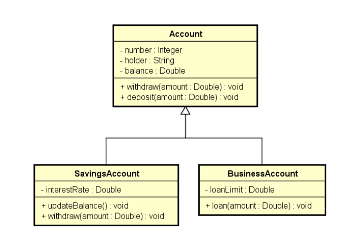

Na foto acima temos que a subclasse(SavingsAccount) sobrepõe o método withdraw.

Exemplo:

Suponha que a operação de
saque possui uma taxa no valor
de 5.0. Entretanto, se a conta
for do tipo poupança, esta taxa
não deve ser cobrada.
Como resolver isso?

Resposta: sobrescrevendo o
método withdraw na subclasse
SavingsAccount

#### Classe SavingsAccount

````java
package newentities;

public class SavingsAccount extends Account {
    private Double interestRate;

    public SavingsAccount() {
        super();
    }

    public SavingsAccount(Integer number, String holder, Double balance, Double interestRate) {
        super(number, holder, balance);
        this.interestRate = interestRate;
    }

    public Double getInterestRate() {
        return interestRate;
    }

    public void setInterestRate(Double interestRate) {
        this.interestRate = interestRate;
    }

    public void updateBalance() {
        balance += balance * interestRate;
    }

    // Sobreposição do método withdraw da classe Account
    @Override
    public void withdraw(Double amount) {
        balance -= amount;
    }
}

````

#### Classe Account

````java
package newentities;

public class Account {
    private Integer number;
    private String holder;
    // protected permite o uso em subclasses de packages diferentes
    protected Double balance;

    public Account() {

    }

    public Account(Integer number, String holder, Double balance) {
        this.number = number;
        this.holder = holder;
        this.balance = balance;
    }

    public Integer getNumber() {
        return number;
    }

    public void setNumber(Integer number) {
        this.number = number;
    }

    public String getHolder() {
        return holder;
    }

    public void setHolder(String holder) {
        this.holder = holder;
    }

    public Double getBalance() {
        return balance;
    }

    // Proibido fazer o setBalance manualmente
//    public void setBalance(Double balance) {
//        this.balance = balance;
//    }

    // Saque
    public void withdraw(Double amount) {
        balance -= amount + 5;
    }

    // Deposito
    public void deposit(Double amount) {
        balance += amount;
    }
}
````

#### Classe Program

````java
package newapplication;

import newentities.Account;
import newentities.SavingsAccount;

public class Program {
    public static void main(String[] args) {
        Account acc1 = new Account(1001, "Alex", 1000.0);
        acc1.withdraw(200.0);
        // Retorna 795
        System.out.println(acc1.getBalance());

        // upcasting
        Account acc2 = new SavingsAccount(1002, "Maria", 1000.0, 0.01);
        acc2.withdraw(200.0);
        // Retorna 800
        System.out.println(acc2.getBalance());

    }
}
````

Note que na classe SavingsAccount nós realizamos a sobreposição do método withdraw, que nesse caso não desconta 5 
reais. Para isso usamos a anotação @Override.

### Palavra super

1. É possível chamar a implementação da superclasse usando a palavra super.

Exemplo: suponha que, na classe BusinessAccount, a regra para saque seja realizar o
saque normalmente da superclasse, e descontar mais 2.0.

````java
package newentities;

// A classe BusinessAccount herda todos os dados e comportamentos da classe Account
public class BusinessAccount extends Account {
    private Double loanLimit;

    public BusinessAccount() {

    }

    // Reaproveitamos o construtor da classe Account
    public BusinessAccount(Integer number, String holder, Double balance, Double loanLimit) {
        // Super serve para "chamar" o construtor da super classe(Account)
        super(number, holder, balance);
        this.loanLimit = loanLimit;
    }

    public Double getLoanLimit() {
        return loanLimit;
    }

    public void setLoanLimit(Double loanLimit) {
        this.loanLimit = loanLimit;
    }

    public void loan(double amount) {
        if (amount <= loanLimit) {
            // balance tem visibilidade protected
            balance += amount - 10.0;
        }
    }

    // Reutiliza o código da superclasse
    @Override
    public void withdraw(Double amount) {
        // Faz uso do método withdraw da superclasse Account
        super.withdraw(amount);
        // Desconto mais dois (5 + 2) = 7
        balance -= 2.0;
    }
}
````

No exemplo acima usamos a palavra-chave super que acessa o método withdraw da superclasse Account para realizar a 
aplicação original do método e em seguida, atribuimos uma taxa de 2.0 a mais no método da superclasse.

## Classes e métodos final

1. Classe: evita que a classe seja herdada
````java
public final class SavingsAccount {}
````
2. Método: evita que o método seja sobreposto

Exemplo - Classe final:

Suponha que você queira evitar que
sejam criadas subclasses de
SavingsAccount

````java
public final class SavingsAccount {}
````

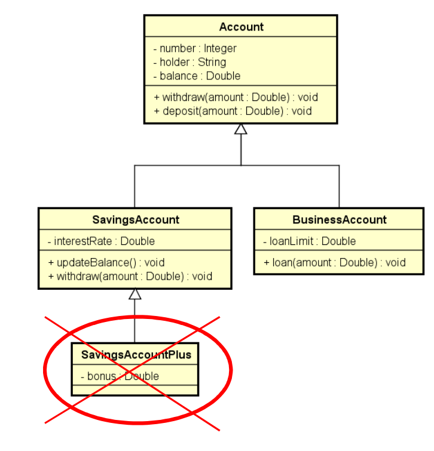

Dessa forma não é possível criar uma subclasse de SavingsAccount como é o caso da SavingsAccountPlus

Exemplo - Método final:

Suponha que você não queira que o método Withdraw de
SavingsAccount seja sobreposto

````java
@Override
public final void withdraw(Double amount) {
    balance -= amount;
}
````

### Mas pra que usar a palavra-chave final?

1. Suponha que você não queira que o método Withdraw de
   SavingsAccount seja sobreposto
   1. Geralmente convém acrescentar final em métodos sobrepostos, pois
      sobreposições múltiplas podem ser uma porta de entrada para
      inconsistências
2. Performance: atributos de tipo de uma classe final são analisados de
   forma mais rápida em tempo de execução.
   1. Exemplo clássico: String

## Introdução ao Polimorfismo

#### Pilares da OOP

1. Encapsulamento
2. Herança
3. Polimorfismo

Em Programação Orientada a Objetos, polimorfismo é recurso que
permite que variáveis de um mesmo tipo mais genérico possam
apontar para objetos de tipos específicos diferentes, tendo assim
comportamentos diferentes conforme cada tipo específico.

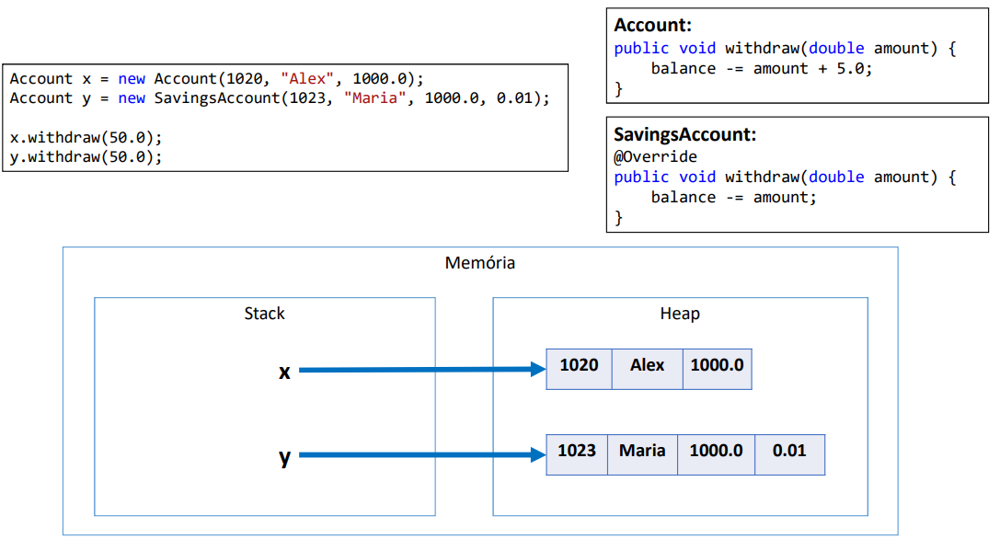

No exemplo acima temos que a variável x irá armazenar a referência para o objeto Account, ja a variável y irá 
armazenar uma referência para o objeto SavingsAccount

NOTA:
1. A associação do tipo específico com o tipo genérico é feita em tempo de
   execução (upcasting).
````java
Account x = new Account(1020, "Alex", 1000.0);
// Upcasting
Account y = new SavingsAccount(1023, "Maria", 1000.0, 0.01);
x.withdraw(50.0);
// O compilador só saberá qual 
// método usar durante o tempo de execução
y.withdraw(50.0);
````
2. O compilador não sabe para qual tipo específico a chamada do método
   Withdraw está sendo feita (ele só sabe que são duas variáveis tipo Account):

Exercício:

Uma empresa possui funcionários próprios e terceirizados.
Para cada funcionário, deseja-se registrar nome, horas
trabalhadas e valor por hora. Funcionários terceirizado
possuem ainda uma despesa adicional.
O pagamento dos funcionários corresponde ao valor da hora
multiplicado pelas horas trabalhadas, sendo que os
funcionários terceirizados ainda recebem um bônus
correspondente a 110% de sua despesa adicional.
Fazer um programa para ler os dados de N funcionários (N
fornecido pelo usuário) e armazená-los em uma lista. Depois
de ler todos os dados, mostrar nome e pagamento de cada
funcionário na mesma ordem em que foram digitados.

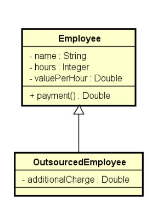

Construa o programa conforme projeto ao lado. Veja
exemplo na próxima página.

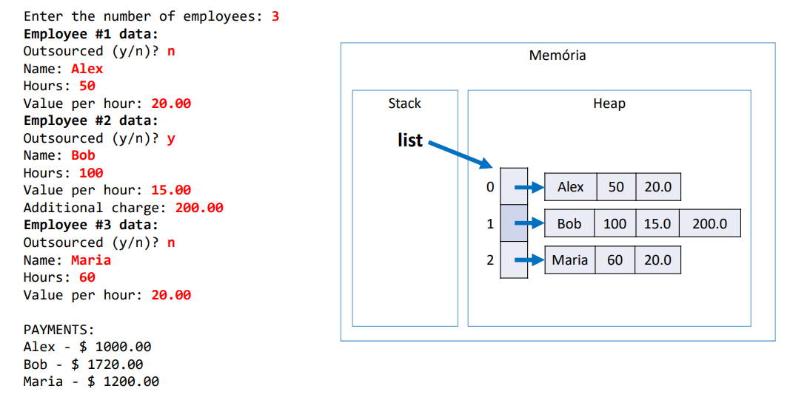

O resultado:

#### Classe Employee

````java
package newentities;

public class Employee {
    private String name;
    private Integer hours;
    private Double valuePerHour;

    public Employee() {

    }

    public Employee(String name, Integer hours, Double valuePerHour) {
        this.name = name;
        this.hours = hours;
        this.valuePerHour = valuePerHour;
    }

    public String getName() {
        return name;
    }

    public void setName(String name) {
        this.name = name;
    }

    public Integer getHours() {
        return hours;
    }

    public void setHours(Integer hours) {
        this.hours = hours;
    }

    public Double getValuePerHour() {
        return valuePerHour;
    }

    public void setValuePerHour(Double valuePerHour) {
        this.valuePerHour = valuePerHour;
    }

    public double payment() {
        return hours * valuePerHour;
    }
}
````

#### Classe OutsourcedEmployee

```java
package newentities;

public class OutsourcedEmployee extends Employee {
    private Double additionalCharge;

    public OutsourcedEmployee() {
        super();
    }

    public OutsourcedEmployee(String name, Integer hours, Double valuePerHour, Double additionalCharge) {
        super(name, hours, valuePerHour);
        this.additionalCharge = additionalCharge;
    }

    public Double getAdditionalCharge() {
        return additionalCharge;
    }

    public void setAdditionalCharge(Double additionalCharge) {
        this.additionalCharge = additionalCharge;
    }

    // Polimorfismo
    @Override
    public double payment() {
        // Usamos o método payment da super classe e modificamos o seu resultado.
        return super.payment() + (additionalCharge * 1.1);
    }
}
```

#### Classe ProgramEmployee

````java
package newapplication;

import newentities.Employee;
import newentities.OutsourcedEmployee;

import java.util.ArrayList;
import java.util.List;
import java.util.Locale;
import java.util.Scanner;

public class ProgramEmployee {
    public static void main(String[] args) {
        Scanner sc = new Scanner(System.in);
        Locale.setDefault(Locale.US);
        List<Employee> listEmp = new ArrayList<>();

        System.out.print("Enter the number of employees: ");
        int numEmp = sc.nextInt();;


        for (int i = 1; i <= numEmp; i++) {
            System.out.println("Employee #" + i + " data");
            System.out.print("Outsorced (y/n)? ");
            // Pega apenas o primeiro caractere
            char ch = sc.next().charAt(0);
            sc.nextLine();
            System.out.print("Name: ");
            String name = sc.nextLine();
            System.out.print("Hours: ");
            int hours = sc.nextInt();
            System.out.print("Value per hour: ");
            double vph = sc.nextDouble();

            if (ch == 'y') {
                System.out.print("Additional charge: ");
                double ac = sc.nextDouble();
                // Instância de um funcionário terceirizado
                Employee emp = new OutsourcedEmployee(name, hours, vph, ac);
                listEmp.add(emp);
            } else {
                Employee emp = new Employee(name, hours, vph);
                listEmp.add(emp);
            }

        }

        System.out.println();
        System.out.println("PAYMENTS:");

        // Percorre a lista
        for (Employee emp : listEmp) {
            System.out.println(emp.getName() + " - $ " + String.format("%.2f", emp.payment()));
        }

        sc.close();
    }
}
````

Exercício:

Fazer um programa para ler os dados de N
produtos (N fornecido pelo usuário). Ao final,
mostrar a etiqueta de preço de cada produto na
mesma ordem em que foram digitados.
Todo produto possui nome e preço. Produtos
importados possuem uma taxa de alfândega, e
produtos usados possuem data de fabricação.
Estes dados específicos devem ser
acrescentados na etiqueta de preço conforme
exemplo (próxima página). Para produtos
importados, a taxa e alfândega deve ser
acrescentada ao preço final do produto.

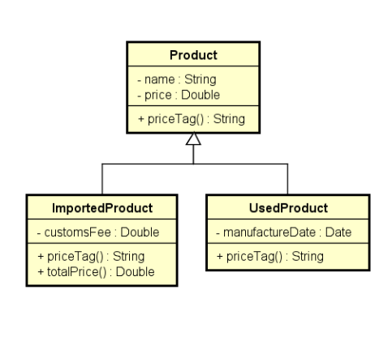

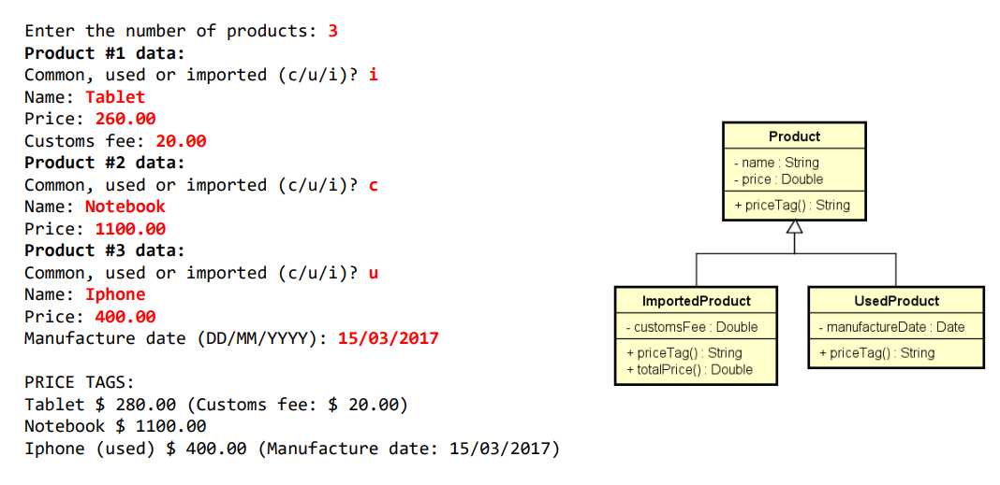

Resolução:

#### Classe Product

````java
package newentities;

public class Product {
    private String name;
    private Double price;

    public Product() {

    }

    public Product(String name, Double price) {
        this.name = name;
        this.price = price;
    }

    public String getName() {
        return name;
    }

    public void setName(String name) {
        this.name = name;
    }

    public Double getPrice() {
        return price;
    }

    public void setPrice(Double price) {
        this.price = price;
    }

    public String priceTag() {
        return name + " $ " + String.format("%.2f", price);
    }
}
````

#### Classe ImportedProduct

````java
package newentities;

public class ImportedProduct extends Product {
    private Double customFee;

    public ImportedProduct() {

    }

    public ImportedProduct(String name, Double price, Double customFee) {
        super(name, price);
        this.customFee = customFee;
    }

    public Double getCustomFee() {
        return customFee;
    }

    public void setCustomFee(Double customFee) {
        this.customFee = customFee;
    }

    public Double totalPrice() {
        return super.getPrice() + customFee;
    }

    @Override
    public String priceTag() {
        return getName() + " $ " + String.format("%.2f", totalPrice()) + " (Customs fee: $ " + String.format("%.2f", customFee) + ")";
    }
}
````

#### Classe UsedProduct

````java
package newentities;

import java.time.LocalDate;
import java.time.format.DateTimeFormatter;

public class UsedProduct extends Product {
    private LocalDate manufactureDate;

    public UsedProduct() {

    }

    public UsedProduct(String name, Double price, LocalDate manufactureDate) {
        super(name, price);
        this.manufactureDate = manufactureDate;
    }

    public LocalDate getManufactureDate() {
        return manufactureDate;
    }

    public void setManufactureDate(LocalDate manufactureDate) {
        this.manufactureDate = manufactureDate;
    }

    @Override
    public String priceTag() {
        return super.getName() + " (used) " + "$ " + String.format("%.2f", super.getPrice()) + " (Manufacture date: " + manufactureDate.format(DateTimeFormatter.ofPattern("dd/MM/yyyy")) + ")";
    }
}
````

#### Classe ProgramProduct

````java
package newapplication;

import newentities.ImportedProduct;
import newentities.Product;
import newentities.UsedProduct;

import java.text.ParseException;
import java.text.SimpleDateFormat;
import java.time.LocalDate;
import java.time.format.DateTimeFormatter;
import java.util.*;

public class ProgramProduct {
    public static void main(String[] args) throws ParseException {
        Scanner sc = new Scanner(System.in);
        Locale.setDefault(Locale.US);
        SimpleDateFormat sdf = new SimpleDateFormat("dd/MM/yyyy");
        List<Product> listProduct = new ArrayList<>();

        System.out.print("Enter the number of products: ");
        int totalProducts = sc.nextInt();

        for (int i = 1; i <= totalProducts; i++) {
            System.out.println("Product #" + i + " data:");
            // c/u/i = comum, usado e importado
            System.out.print("Common, used or imported (c/u/i)? ");
            char ch = sc.next().charAt(0);
            sc.nextLine();
            System.out.print("Name: ");
            String name = sc.nextLine();
            System.out.print("Price: ");
            double price = sc.nextDouble();

            if (ch == 'i') {
                System.out.print("Custom fee: ");
                double customFee = sc.nextDouble();
                Product product = new ImportedProduct(name, price, customFee);
                listProduct.add(product);
            } else if (ch == 'u') {
                System.out.print("Manufacture date (DD/MM/YYYY): ");
                LocalDate date = LocalDate.parse(sc.next(), DateTimeFormatter.ofPattern("dd/MM/yyyy"));
                Product product = new UsedProduct(name, price, date);
                listProduct.add(product);
            } else if (ch == 'c') {
                Product product = new Product(name, price);
                listProduct.add(product);
            }
        }

        System.out.println();
        System.out.println("PRICE TAGS: ");
        for (Product product : listProduct) {
            System.out.println(product.priceTag());
        }

        sc.close();
    }
}
````

Foi utilizado o LocalDate para pegar a data local.

[Voltar](../README.md)

