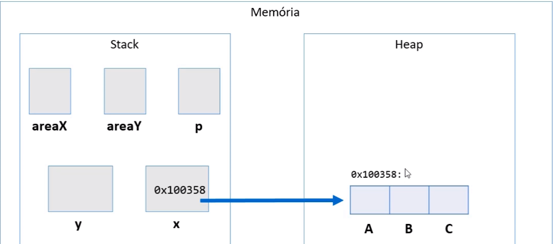
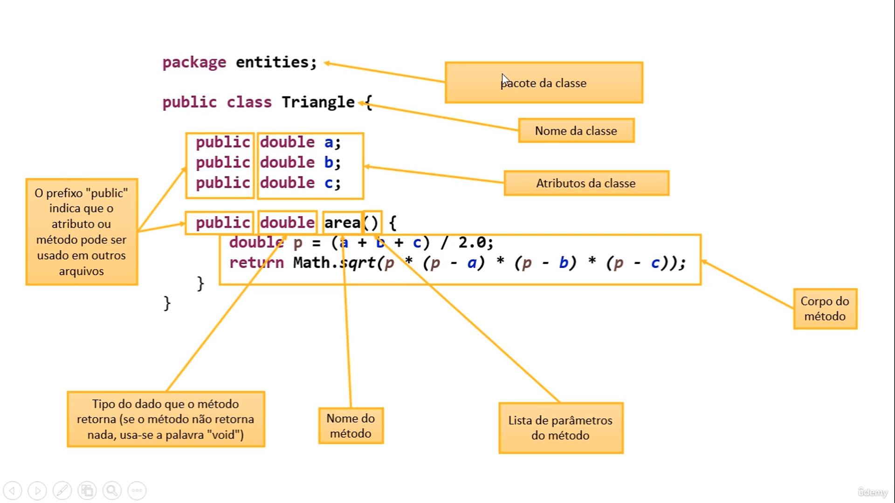
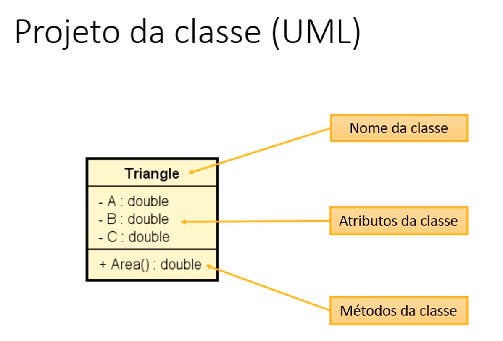

# Entrada de dados em Java

## Classe Scanner

Para realizar a entrada de dados(input) é necessário criar um objeto(instância) do tipo Scanner, vejamos:

```java
import java.util.Scanner;

public class Main {
    public static void main(String[] args) {
        Scanner sc = new Scanner(System.in);
        sc.close();
    }
}
```

Note que criamos uma instância(objeto) da classe Scanner e passamos System.in como argumento, isso significa dizer
que queremos a entrada de dados. Além disso, note que importamos a API java.util.Scanner para poder usar a classs
Scanner. Por fim, usamos o método .close() para "desalocar" o uso do objeto.

```java
import java.util.Scanner;

public class Main {
    public static void main(String[] args) {
        String text;
        Scanner sc = new Scanner(System.in);
        text = sc.next();
        System.out.println(text);
        sc.close();
    }
}
```

No exemplo acima usamos o método .next() que lê a primeira coisa digitada no terminal. Por fim fechamos a conexão com o
objeto.

Java disponibiliza alguns métodos para leitura, vejamos:

```java
import java.util.Scanner;

public class Main {
    public static void main(String[] args) {
        int age;
        float weight;
        double height;
        String name;

        Scanner sc = new Scanner(System.in);

        // Lê um número inteiro
        System.out.print("Digite a sua idade: ");
        age = sc.nextInt();

        // Lê um número decimal
        System.out.print("Digite o seu peso: ");
        weight = sc.nextFloat();

        // Lê um número decimal de dupla precisão
        System.out.print("Digite a sua altura: ");
        height = sc.nextDouble();

        // Lê qualquer coisa digitada no terminal
        System.out.print("Digite o seu nome: ");
        name = sc.next();

        // Exibe o resultado na tela
        System.out.printf("\nName: %s\nAge: %d\nHeight: %.1f\nWeight: %.1f\n", name, age, height,weight);
        // Fecha a conexão com o objeto
        sc.close();
    }
}
```

NOTA: O tipo double pega a assinatura do sistema, ou seja, se seu sistema está em PT-BR isso significa dizer que ele
vai receber dados usando vírgula, caso contrário ele recebe usando ponto.

Podemos usar o método .nextLine() que armazena um valor como string, vejamos:

```java
import java.util.Scanner;

public class Main {
    public static void main(String[] args) {
        // Cria um objeto do tipo Scanner
        Scanner sc = new Scanner(System.in);

        String name, age, weight, height;

        // O método .nextLine() lê uma string
        System.out.print("Digite o seu nome: ");
        name = sc.nextLine();
        System.out.print("Digite a sua idade: ");
        age = sc.nextLine();
        System.out.print("Digite o seu peso: ");
        weight = sc.nextLine();
        System.out.print("Digite a sua altura: ");
        height = sc.nextLine();
        // Exibe os resultados
        System.out.printf("Name: %s\nAge: %s\nWeight: %s\nHeight: %s\n", name, age, weight, height);
        // Fecha a conexão com o objeto
        sc.close();
    }
}
```

Todos os valores digitados e armazenados nas variáveis são do tipo String.

A diferença entre os métodos next() e nextLine() é que o método next() lê apenas a primeira coisa digitada no
terminal, ja o método nextLine() lê tudo que for digitado.

NOTA: Em java temos um problema relacionado a entrada de dados como é o caso em C, quando usamos um método diferente
do nextLine(), temos que o caractere de quebra de linha `\n` irá ser armazenado na variável seguinte, ou seja, na
seguinte entrada de dados, vejamos:

```java
import java.util.Scanner;

public class Main {
    public static void main(String[] args) {
        int num;
        String str1, str2, str3;

        Scanner sc = new Scanner(System.in);

        // Recebe um valor inteiro
        num = sc.nextInt();

        // Recebe valores do tipo string
        str1 = sc.nextLine();
        str2 = sc.nextLine();
        str3 = sc.nextLine();
    }
}
```

Ou seja, quando digitarmos o primeiro valor que é um inteiro temos que a segunda variável irá armazenar o caractere
de quebra de linha `\n`, isso acaba gerando um problema onde a variável str1 não irá armazenar o valor desejado.
Para resolver isso basta `limpar o buffer do teclado` usando o método sc.nextLine(). Vejamos:

```java
import java.util.Scanner;

public class Main {
    public static void main(String[] args) {
        int num;
        String str1, str2, str3;

        Scanner sc = new Scanner(System.in);

        // Recebe um valor inteiro
        num = sc.nextInt();

        // Limpando o buffer do teclado
        sc.nextLine();

        // Recebe valores do tipo string
        str1 = sc.nextLine();
        str2 = sc.nextLine();
        str3 = sc.nextLine();

        System.out.println(num);
        System.out.println(str1);
        System.out.println(str2);
        System.out.println(str3);
    }
}
```

## Funções Matemáticas

Usamos a API Math do java, vejamos algumas funções matemáticas:

```java
public class Main {
    public static void main(String[] args) {
        double x = 3.0;
        double y = 4.0;
        double z = -5.0;

        System.out.printf("O quadrado de %f é: %f\n", Math.pow(x, 2));
        System.out.printf("A raiz quadrada de %f é: %f\n", Math.sqrt(y));
        System.out.printf("O valor absoluto de %f é: %f\n", Math.abs(z));
    }
}
```

## Outros tópicos básicos sobre Java

### Conveções para nomes

Em java, nós usamos o padrão camelCase para declarar:

- pacotes
- atributos
- métodos
- variáveis e parâmetros

Já para o caso de classes, nós usamos o padrão PascalCase:

```java
class NomeDaClasse {
    // faz algo
}
```

Vejamos um exemplo de código que contém esses dois padrões:

```java
// Pacote
package entities;

// Classe
public class Account {
    // Variáveis
    private String holder;
    private Double balance;

    // Métodos
    public Account(String holder, Double balance) {
        this.holder = holder;
        this.balance = balance;
    }

    public String getHolder() {
        return holder;
    }

    public void deposit(Double amount) {
        balance += amount;
    }

    public void withdraw(Double amount) {
        balance -= amount;
    }
}
```

### Funções interessantes para Strings

Java disponibiliza algumas funções bem interessantes para o manuseio de strings:

- Formatar: toLowerCase(), toUpperCase() e trim()
- Recortar: substring(inicio), substring(inicio, fim)
- Substituir: Replace(char, char), Replace(string, string)
- Buscar: IndexOf, LastIndexOf
- str.Split("")

Vejamos alguns exemplos

```java
package course;

public class Program {
    public static void main(String[] args) {
        String original1 = "OI, EU ESTOU EM MAIÚSCULO!";

        // Exibe o resultado convertido para minúsculo
        System.out.println(original1.toLowerCase());

        String original2 = "oi, eu estou em minúsculo!";

        // Exibe o resultado convertido para maiúsculo
        System.out.println(original2.toUpperCase());

        String original3 = "   Oi, eu tenho espaços em branco nas laterais!  ";

        // Exibe o resultado sem os espaços em branco
        System.out.println(original3.trim());

        // Cria uma substring começando no caractere de índice 4
        String original4 = original1.substring(4);
        System.out.println(original4);

        // Cria uma substring começando no índice 4 e terminando no índice 12
        String original5 = original1.substring(4, 12);
        System.out.println(original5);

        // Substituir os caracteres E por X
        String original6 = original1.replace('E', 'X');
        System.out.println(original6);

        // Armazena a posição de determinada frase e exibe o resultado
        int original7 = original1.indexOf("ESTOU");
        System.out.println(original7);

        // A função split() separa uma string em substrings que são armazeandas em arrays
        String s = "Potato Apple Lemon";
        // Armazenamos os três valores no array usando a função split que
        // separa por espaços em branco
        String[] arr = s.split(" ");

        // Exibindo os valores
        System.out.println(arr[0]);
        System.out.println(arr[1]);
        System.out.println(arr[2]);
    }
}
```

### Exemplo de resolução de problema "sem usar OOP"

```java
package application;

import java.util.Scanner;
// Exemplo de problema "sem" utilizar POO
public class Program {
    public static void main(String[] args) {
        // Declaramos 6 variáveis do tipo double
        double xA, xB, xC, yA, yB, yC;
        double areaX, areaY, pX, pY;
        // Criamos um objeto(instância) da classe Scanner
        Scanner sc = new Scanner(System.in);
        // Solicitamos os lados do triângulo X
        System.out.println("Enter the measures of triangle X: ");
        xA = sc.nextDouble();
        xB = sc.nextDouble();
        xC = sc.nextDouble();
        // Solicitamos os lados do triângulo Y
        System.out.println("Enter the measure of triangle Y: ");
        yA = sc.nextDouble();
        yB = sc.nextDouble();
        yC = sc.nextDouble();

        // Calcula o valor de p para X e Y
        pX = (xA + xB + xC) / 2;
        pY = (yA + yB + yC) / 2;

        // Calcula a área de cada triângulo
        areaX = Math.sqrt(pX * (pX - xA) * (pX - xB) * (pX - xC));
        areaY = Math.sqrt(pY * (pY - yA) * (pY - yB) * (pY - yC));

        // Exibe o resultado da area de cada triângulo
        System.out.println("Area do triângulo x é: " + areaX);
        System.out.println("Area do triângulo y é: " + areaY);

        // Compara as áreas e retorna algo
        if (areaX > areaY) {
            System.out.println("Area do triângulo X é maior!");
        } else {
            System.out.println("Area do triângulo Y é maior!");
        }

        // Encerra o uso da classe Scanner
        sc.close();
    }
}
```

## Classes

Classes são um `tipo estruturado` que pode conter **membros:**

- Atributos(dados / campos)
- Métodos (funções / operações)

Além disso, a `classe também pode prover muitos outros recursos, tais como:

- Construtores
- Sobrecarga
- Encapsuulamento
- Herança
- Polimorfismo

Exemplos:

- `Entidades: Produto, Cliente, Triangulo`
- `Serviços: ProdutoService, ClienteService, EmailService, StorageService`
- `Controladores: ProdutoController, ClienteController`
- `Utilitários: Calcuuladora, Compactador`
- `Outros (views, repositórios, gerenciadores, etc.)`

### Usando classes e atributos para representar uma entidade chamada triângulo

Anteriormente resolvemos uma questão para calcular qual dos triângulos era maior, mas fizemos isso de uma forma que
não utilizamos "classes", vejamos agora a solução usando uma classe chamada Triangle:

```java
package entities; // O triângulo é uma entidade

public class Triangle {
    // Atributos que podem ser usados por outras classes
    public double a;
    public double b;
    public double c;
}
```

- Classe Program é o `core` da nossa aplicação

```java
package application;
// Importamos o pacote entities e a classe que queremos usar
import entities.Triangle;

import java.util.Scanner;
// Exemplo de problema "sem" utilizar POO
public class Program {
    public static void main(String[] args) {
        // Declaramos 6 variáveis do tipo double
//        double x.a, x.b, x.c, y.a, y.b, y.c;

        // Duas variáveis x e y do tipo Triangle
        Triangle x, y;
        // Criando objetos(instâncias) da classe Triangle
        x = new Triangle();
        y = new Triangle();

        double areaX, areaY, pX, pY;
        // Criamos um objeto(instância) da classe Scanner
        Scanner sc = new Scanner(System.in);
        // Solicitamos os lados do triângulo X
        System.out.println("Enter the measures of triangle X: ");
        x.a = sc.nextDouble();
        x.b = sc.nextDouble();
        x.c = sc.nextDouble();
        // Solicitamos os lados do triângulo Y
        System.out.println("Enter the measure of triangle Y: ");
        y.a = sc.nextDouble();
        y.b = sc.nextDouble();
        y.c = sc.nextDouble();

        // Calcula o valor de p para X e Y
        pX = (x.a + x.b + x.c) / 2;
        pY = (y.a + y.b + y.c) / 2;

        // Calcula a área de cada triângulo
        areaX = Math.sqrt(pX * (pX - x.a) * (pX - x.b) * (pX - x.c));
        areaY = Math.sqrt(pY * (pY - y.a) * (pY - y.b) * (pY - y.c));

        // Exibe o resultado da area de cada triângulo
        System.out.printf("Area do triângulo x é: %.1f%n", areaX);
        System.out.printf("Area do triângulo y é: %.1f%n", areaY);

        // Compara as áreas e retorna algo
        if (areaX > areaY) {
            System.out.println("Area do triângulo X é maior!");
        } else {
            System.out.println("Area do triângulo Y é maior!");
        }

        // Encerra o uso da classe Scanner
        sc.close();
    }
}
```

Note que criamos ~~doi~~s objetos(duas cópias/instâncias) da classe Triangle e em seguida, usamos a palavra reservada
ǹew`para instanciar esses objetos, por fim acessamos as duas classes usando a notação dot(.) e atribuimos seus
respectivos valores.

## Memória: Stack e Heap

**As variáveis estáticas, como double areaX, areaY, pX, pY são alocadas na memória Stack, já os objetos(instâncias)
são alocadas na memória Heap. No entanto, os objetos instânciados possuem um endereço de memória que fica salvo na
memória Stack, porém esse endereço de memória apenas aponta para o endereço de memória na memória Heap.**



Representamos esse "apontamento de memória" usando a seta azul na imagem acima.

## Criando um método para obtermos os benefícios de reaproveitamento e delegação

Note que no nosso exemplo anterior, nós podemos simplificar o cálculo da área de um triângulo usando um método na 
classe Triangle, dessa forma nós podemos reusar esse método quantas vezes quisermos.

**Classe Triangle com a implementação do método area()**
```java
package entities; // O triângulo é uma entidade

public class Triangle {
    // Atributos que podem ser usados por outras classes
    public double a;
    public double b;
    public double c;

    // Método que cálcula a área de um triângulo
    public double area() {
        // Estamos trabalhando com os atributos da classe
        double p = (a + b + c) / 2.0;
        // Retorna o cálculo da área
        return Math.sqrt(p * (p - a) * (p - b) * (p - c));
    }
}
```
**Classe Program com o método area()**
```java
package application;
// Importamos o pacote entities e a classe que queremos usar
import entities.Triangle;

import java.util.Scanner;
// Exemplo de problema "sem" utilizar POO
public class Program {
    public static void main(String[] args) {
        // Declaramos 6 variáveis do tipo double
//        double x.a, x.b, x.c, y.a, y.b, y.c;

        // Duas variáveis x e y do tipo Triangle
        Triangle x, y;
        // Criando objetos(instâncias) da classe Triangle
        x = new Triangle();
        y = new Triangle();

        double areaX, areaY;
        // Criamos um objeto(instância) da classe Scanner
        Scanner sc = new Scanner(System.in);
        // Solicitamos os lados do triângulo X
        System.out.println("Enter the measures of triangle X: ");
        x.a = sc.nextDouble();
        x.b = sc.nextDouble();
        x.c = sc.nextDouble();
        // Solicitamos os lados do triângulo Y
        System.out.println("Enter the measure of triangle Y: ");
        y.a = sc.nextDouble();
        y.b = sc.nextDouble();
        y.c = sc.nextDouble();

        // Chamamos o método area da classe Triangle
        areaX = x.area();
        areaY = y.area();

        // Exibe o resultado da area de cada triângulo
        System.out.printf("Area do triângulo x é: %.1f%n", areaX);
        System.out.printf("Area do triângulo y é: %.1f%n", areaY);

        // Compara as áreas e retorna algo
        if (areaX > areaY) {
            System.out.println("Area do triângulo X é maior!");
        } else {
            System.out.println("Area do triângulo Y é maior!");
        }

        // Encerra o uso da classe Scanner
        sc.close();
    }
}
```

No exemplo acima note que usamos o método area e os atributos da classe Triangle, ou seja, não foi necessário passar 
os valores por parâmetro visto que os atributos estão presentes na classe.

### Beneficios do uso do método area() da classe Triangle:
1. Reaproveitamento de código pois elimina o código repetido.
2. Delegação de responsabilidades: Basicamente significa dizer quem deve ser responsável por saber como calcular a 
   área de um triângulo é o próprio triângulo(A classe Triangle). A lógica da área não deve estar em outro lugar.

**Estrutura completa da nossa classe Triangle**


## Projeto da classe (UML)

O UML é um diagrama muito utilizado para representar a estrutura do nosso código, no exemplo abaixo representamos a 
classe Triangle que contém seus três atributos e o seu método area().



Note que primeiro temos o nome da classe seguido dos atributos e por fim os métodos da classe. Veremos mais sobre 
UML no decorrer do aprendizado.

[Voltar](../README.md)
