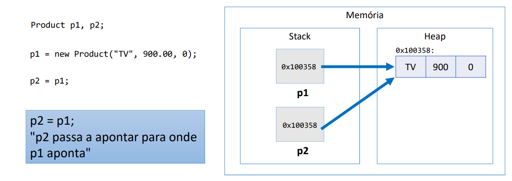
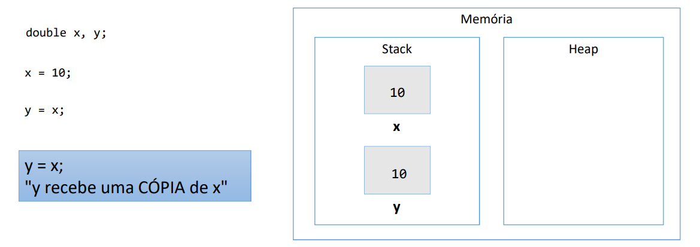
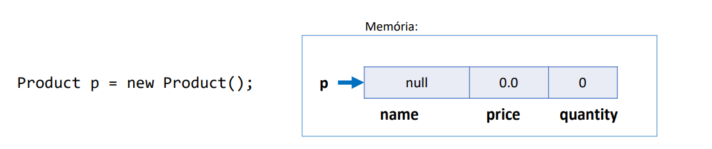
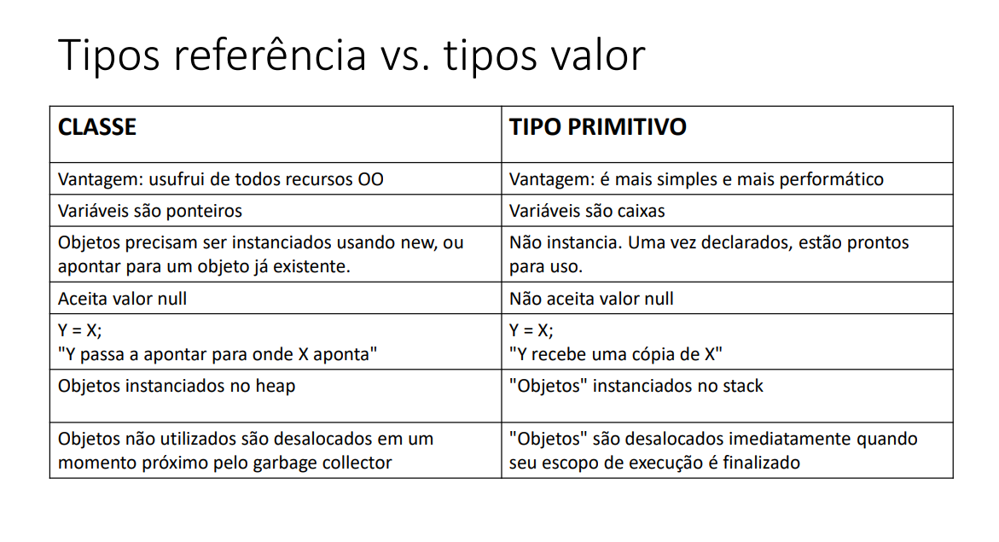
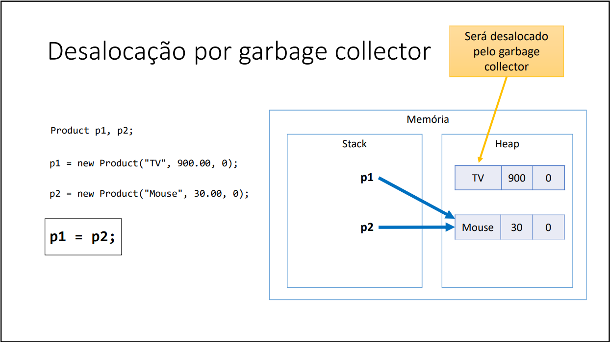
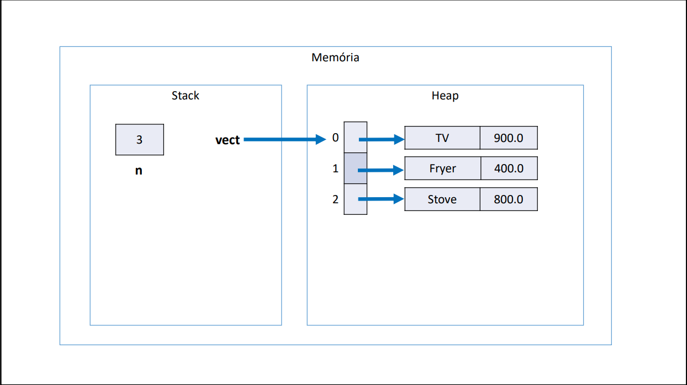
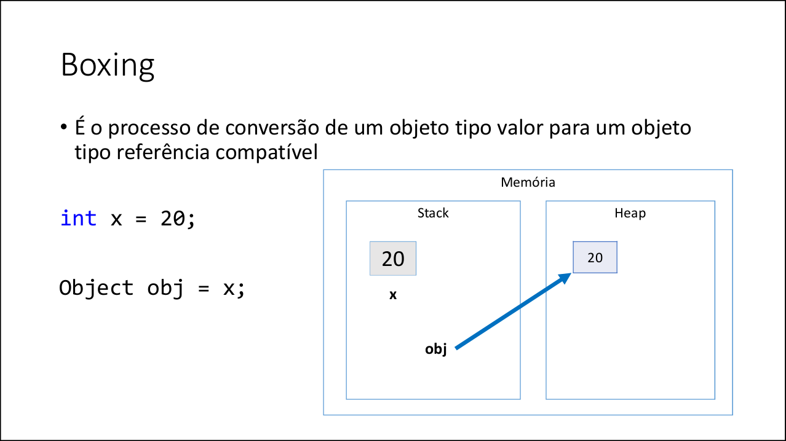
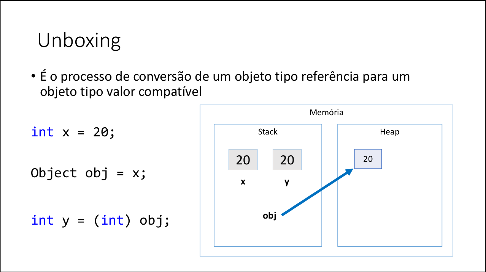
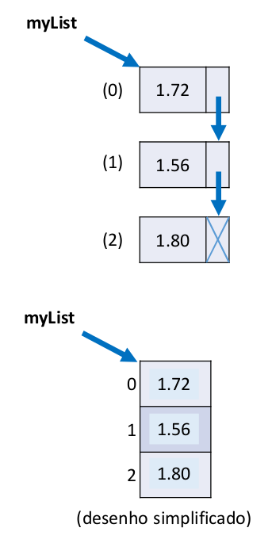

# Comportamento de memória, arrays e listas


## Classes são tipos referência
Variáveis cujo tipo são **classes não devem ser entedidas como caixas, mas sim "tentáculos"(ponteiros) para caixas.**

Suponhamos que temos uma classe chamada Product com duas variáveis, p1 e p2.

````java
Product p1, p2;
````

**Essas variáveis(p1 e p2) estarão alocadas na memória stack. No entanto, quando fazemos a variável receber um novo 
produto, ou seja, criamos uma instância dessa classe e passamos os valores abaixo temos que:**
````java
p1 = new Product("TV", 900.00, 0);
````

**Será alocado um objeto na memória Heap, que é uma alocação dinâmica pois os objetos são alocados em tempo de 
execução. Além disso, a variável p1 não irá guardar o product em sí, mas o endereço de memória onde o objeto foi 
alocado.** **Ou seja, a variável p1 que está alocada na memória stack irá armazenar um ponteiro que aponta para o 
objeto na memória heap.**



**No exemplo acima temos que a variável p1 que está alocada na memória stack armazena um endereço que representa a 
posição em que o objeto instânciado com os valores passados está armazenado na memória heap. Chamamos isso de 
ponteiro.**

**Por fim, é possível atribuir os valores da variável p1 para a variável p2, quando fazemos isso temos que a variável 
p2 irá apontar para o objeto instânciado pela variável p1, ou seja, mantendo os seus valores.**

## Valor "null"
**Tipos referência aceitam o valor "null", que indica que a `variável aponta para ninguém`.**

````java
Product p1, p2;

p1 = new Product("TV", 900. 0);
````

Nesse caso temos que p1 aponta para o objeto instânciado na memória heap, já a variável p2 não aponta ninguém, ou 
seja, ela é null.

## Tipos primitivos são tipos valor

**Em java, tipos primitivos são tipos valor. Tipos valor são caixas e não ponteiros.**

````java
double x, y;
````

**As variáveis x, y são do tipo primitivo double que são variáveis armazenadas na memória stack.**

````java
double x, y;

y = x;
````

**Se fizermos y = x, ou seja, passamos uma cópia do valor de x para y.**

O exemplo abaixo é uma representação das variáveis primitivas e a memória stack. 



## Tipos primitivos e inicialização

- Demo
````java
int p;
// Error: Variável não inicializada
System.out.println(p)

p = 10;
System.out.println(p)
````

Não é possível imprimir algo que não existe, ou seja, que não foi inicializado.

### Valores padrão

1. Quando alocamos (new) qualquer tipo estruturado (classe ou array) são atribuídos valores padrão aos seus elementos
   1. números: 0
   2. boolean: false
   3. char: caractere código 0
   4. objeto: null

````java
Product p = new Product();
````

Quando alocamos (instânciamos uma classe) temos que os valores dos atributos serão padrão, como descritos acima.



## Tipos referência vs tipos valor

Vantagens e desvantagens de cada tipo



## Garbage Collector
1. É um processo que automatiza o gerenciamento de memória de um programa em execução.
2. O garbage collector monitora os objetos alocados dinamicamente pelo programa (no heap), desalocando aqueles que 
   não estão mais sendo utilizados.

Exemplo do garbage collector em ação


Note que quando fazemos p1 receber p2, temos que o valor de p1 ficará sem uso, nesse caso o garbage collector irá 
desalocar os recursos anteriormente armazenados na variável p1.

Por fim, variáveis locais(exemplo: variáveis em estruturas if, while etc) serão desalocadas imediatamente assim que 
seu escopo local sair de execução.

## Vetores

1. Vetores são basicamente um array unidimensional que possui elementos e cada elemento possui um índice, sempre 
começando no índice 0.
2. Array é um estrutura de dados:
   1. Homogênea(dados do mesmo tipo)
   2. Ordenada(elementos acessados por meio de posições)
   3. Alocada de uma vez só, em um bloco contíguo de memória
3. Vantagens:
   1. Acesso imediato aos elementos pela sua posição
4. Desvantagens:
   1. Tamanho fixo
   2. Dificuldade para se realizar inserções e deleções

Problema exemplo 1:
Fazer um programa para ler um número inteiro N e a altura de N pessoas. Armazene as N alturas em um vetor. Em 
seguida, mostrar a altura média dessas pessoas.

Input:
3
1.72
1.56
1.80

Output:
AVERAGE HEIGHT = 1.69

Resultado do programa:
````java
package application;

import java.util.Locale;
import java.util.Scanner;

public class ProgramAverageHeight {
    public static void main(String[] args) {
        Locale.setDefault(new Locale("en", "US"));
        Scanner sc = new Scanner(System.in);

        System.out.print("Enter an array size: ");
        int number = sc.nextInt();
        double averageHeight = 0;
        double[] arr = new double[number];

        for (int i = 0; i < number; i++) {
            System.out.print("Enter your height: ");
            arr[i] = sc.nextDouble();
            averageHeight += arr[i];
        }
        // Divide a soma dos elementos pela quantidade de elementos presentes no array.
        averageHeight /= number;

        System.out.printf("AVERAGE HEIGHT = %.2f%n", averageHeight);

        sc.close();
    }
}
````

Problema exemplo 2:
Fazer um programa para ler um número inteiro N e os dados (nome e preço) de N produtos. Armazene os N produtos em um 
vetor. Em seguida, mostrar o preço médio dos produtos.

Classe Product2
```java
package entities;

public class Product2 {
    private String name;
    private double price;

    // Construtor com dois parâmetros
    public Product2(String name, double price) {
        this.name = name;
        this.price = price;
    }

    public String getName() {
        return  name;
    }

    public void setName(String name) {
        this.name = name;
    }

    public double getPrice() {
        return price;
    }

    public void setPrice(double price) {
        this.price = price;
    }
}
```

Classe ProgramAveragePrice
```java
package application;

import entities.Product2;

import java.util.Locale;
import java.util.Scanner;

public class ProgramAveragePrice {
   public static void main(String[] args) {
      Locale.setDefault(Locale.US);
      Scanner sc = new Scanner(System.in);

      System.out.print("Enter a number: ");
      int number = sc.nextInt();
      // Limpa o buffer do teclado
      sc.nextLine();
      String productName;
      double productPrice;
      double averagePrice = 0;
      Product2[] vect = new Product2[number];

      for (int i = 0; i < number; i++) {
         System.out.print("Product name: ");
         productName = sc.next();
         System.out.print("Product price: ");
         productPrice = sc.nextDouble();
         // Instanciamos a classe Product2 passando os dois argumentos para o construtor
         vect[i] = new Product2(productName, productPrice);
      }

      for (int i = 0; i < number; i++) {
         // Para cada objeto da classe nós acessamos o seu valor e armazenamos
         // na variável abaixo.
         averagePrice += vect[i].getPrice();
      }

      System.out.printf("AVERAGE PRICE = %.2f%n", averagePrice / number);

   }
}
```

No exemplo acima nós criamos um "array de classe" onde passamos um valor n como quantidade de elementos que esse 
array irá armazenar. Note que criamos uma variável chamada vect que é um vetor e essa variável será armazenada na 
memória stack que irá apontar a referência para os n slots de memória na memória heap. Porém, esses valores do vetor 
são nulos, para isso é necessário instanciar esse objeto atribuindo valores para ele como vemos no exemplo a direita.


Ou seja, de forma resumida, criamos três instâncias da classe Product2 passando o nome e o preço do produto, depois 
acessamos o valor de cada produto usando o método getPrice.

### Desafio sobre vetores
A dona de um pensionato possui dez quartos para alugar para estudantes, sendo esses quartos identificados pelos 
números 0 a 9.

Fazer um programa que inicie com todos os dez quartos vazios, e depois leia uma quantidade N representando o número 
de estudantes que vão alugar quartos (N pode ser de 1 a 10). Em seguida, registre o aluguel dos N estudantes. Para 
cada registro de aluguel, informaro nome e email do estudante, bem como qual dos quartos ele escolheu (de 0 a 9). 
Suponha que seja escolhido um quarto vago. Ao final, seu programa deve imprimir um relatório de todas ocupações do 
pensionato, por ordem de quarto, conforme exemplo:

Input:
How many rooms will be rented? 3

Rent #1:
Name: Maria Green
Email: maria@gmail.com
Room: 5

Rent #2:
Name: Marco Antonio
Email: marco@gmail.com
Room: 1

Rent #3:
Name: Alex Brown
Email: alex@gmail.com
Room: 8

Busy rooms:
1: Marco Antonio, marco@gmail.com
5: Maria Green, maria@gmail.com
8: Alex Brown, alex@gmail.com

Solução:
Classe Room
```java
package entities;

public class Room {
    private String name;
    private String email;
    private int room;

    public Room(String name, String email, int room) {
        this.name = name;
        this.email = email;
        this.room = room;
    }

    public String getName() {
        return name;
    }

    public String getEmail() {
        return email;
    }

    public int getRoom() {
        return room;
    }

    public String toString() {
        return String.format("%d: %s, %s", room, name, email);
    }
}
```

Classe ProgramRoomRent
```java
package application;

import entities.Room;

import java.util.Locale;
import java.util.Scanner;

public class ProgramRoomRent {
    public static void main(String[] args) {
        Locale.setDefault(Locale.US);
        Scanner sc = new Scanner(System.in);

        String clientName;
        String clientEmail;
        int clientRoom;
        int totalOfRooms;

        int[] room = new int[10];
        Room[] rentRoom = new Room[10];

        System.out.print("How many rooms will be rented? ");
        totalOfRooms = sc.nextInt();
        // Limpa o buffer do teclado
        sc.nextLine();

        for (int i = 0; i < totalOfRooms; i++) {
            System.out.printf("%nRent #%d%n", i + 1);
            System.out.print("Name: ");
            clientName = sc.nextLine();
            System.out.print("Email: ");
            clientEmail = sc.nextLine();
            System.out.print("Room: ");
            clientRoom = sc.nextInt();
            sc.nextLine();
            // Criamos uma instância da classe Room e inicializamos o contrutor
            rentRoom[clientRoom] = new Room(clientName, clientEmail, clientRoom);
        }

        // Analisa se a instância na posição j está vazia
        System.out.printf("%nBusy rooms:%n");
        for (int j = 0; j < 10; j++) {
            if (rentRoom[j] != null) {
                System.out.println(rentRoom[j]);
            }
        }
    }
}
```

## Boxing
1. É o processo de conversão de um objeto tipo valor para um objeto tipo referência compartível



No exemplo acima passamos um valor x do tipo primitivo para um objeto, esse objeto irá apontar para esse valor na 
memória heap.

## Unboxing
1. É o processo de conversão de um objeto tipo referência para um objeto tipo valor compatível



No exemplo acima nós pegamos uma variável do tipo objeto e fazemos o casting, transformando o valor dela para um 
tipo primitivo. Esse processo faz y receber 20 direto na memória stack.

## Wrapper Classes
1. São classes equivalentes aos tipos primitivos
2. Boxing e Unboxing é natural na linguagem
3. Uso comum:
   1. Campos de entidades em sistemas de informação (IMPORTANTE!)
      1. Pois tem tipos referência (classes) aceitam valor null e usufruem dos recursos OO.

Exemplo:
```java
public class Product {
    public String name;
    public Double price;
    public Integer quantity;
}
```

Note que usamos as wrapper classes, é recomendado pois caso o valor não seja passado, teremos um valor null.

## Laço `for each`

O laço for each possui uma sintaxe opcional e simplificada para percorrer coleções.

Sintaxe:
```java
for (Tipo apelido: coleção){
   <comando 1>
   <comando 2>
}
```

Exemplo real:
```java
package application;

public class ProgramForEach {
    public static void main(String[] args) {
        // Instânciamos um array de Strings e inicializamos com 3 valores
        String[] vect = new String[] {"Maria", "Bob", "Alex"};

        // Tipo de dado dos elementos - Nome(Apelido) : nome da coleção(vect)
        for (String nome : vect) {
            System.out.println(nome);
        }
    }
}
```

Podemos ler o programa acima da seguinte forma: Para cada objeto nome(apelido) contido em vect(tipo da coleção) faça 
algo...

## Listas
1. Lista é uma estrutura de dados:
   1. Homogênea (dados do mesmo tipo)
   2. Ordenada (elementos acessados por meio de posições)
   3. Inicia vazia, e seus elementos são alocados **sob demanda**
   4. Cada elemento ocupa um "nó" (ou nodo) da lista
2. Tipo (interface): List
3. Classes que implementam: ArrayList, LinkedList, etc.
4. Vantagens:
   1. Tamanho variável
   2. Facilidade para se realizar inserções e deleções
5. Desvantagens:
   1. Acesso sequencial ao elementos



### Operações envolvendo listas
1. Tamanho da lista: size()
2. Inserir elementos na lista: add(obj), add(int, obj)
3. Remover elementos da lista: remove(obj), remove(int), removeIf(Predicate)
4. Encontrar posição de elemento: indexOf(obj), lastIndexOf(obj)
5. Filtrar lista com base em predicados:
```java
List<Integer> result = list.stream().filter(x -> x > 4).collect(Collectors.
   toList());
```
6. Encontrar primeira ocorrência com base em predicado:
```java
Integer result = list.stream().filter(x -> x > 4).findFirst().orElse(null);
```

**NOTA 1:** A lista não aceita tipos primitivos, apenas wrapper classes.
**NOTA 2:** Os símbolos <> são chamados de generics. Eles servem para parametrizar um tipo de uma determinada coleção.
**NOTA 3:** O comando new ArrayList<>() serve para instânciar a classe ArrayList que implementa a interface List. O 
tipo em sí é uma interface.

A classe ArrayList é extremamente otimizada, ela faz uso tanto das qualidades de um array como de uma lista.


## Convertendo a lista para um tipo stream
O tipo stream aceita operações com expressões lambda.

```java
package application;

import java.util.ArrayList;
import java.util.List;
import java.util.stream.Collectors;

public class ProgramListIntegerNumber {
    public static void main(String[] args) {
        List<String> list = new ArrayList<>();

        // Adicionando elementos a lista com o método add()
        list.add("Maria");
        list.add("Alex");
        list.add("Bob");
        list.add("Anna");
        // Adicionando um elemento em uma posição já ocupada
        // O elemento não é prejudicado, ele eleva o seu índice em uma unidade
        list.add(2, "Marco");

        // Exibindo o tamanho da lista com o método size()
        System.out.println("List size: " + list.size() + " elements");

        // Usando um laço for each para percorrer os elementos da lista
        for (String value: list) {
            System.out.println(value);
        }

        System.out.println("-Removendo usuários-");

        // Removendo elementos usando seu valor, índice ou predicado
        list.remove(1); // Remove o Alex
        list.remove("Anna"); // Remove a Anna

        // Removendo por predicado
        // x é do tipo string, analisa se o primeiro caractere é M
        list.removeIf(x -> x.charAt(0) == 'M'); // Função lambda

        System.out.println("Usuários ativos: " + list);

        // Exibe o índice do elemento passado como argumento usando o método indexOf()
        System.out.println("Index of Bob: " + list.indexOf("Bob"));
        // Quando o elemento não existe, retorna -1
        System.out.println("Index of PessoaX: " + list.indexOf("PessoaX"));

        // Armazena o resultado filtrado na lista result.
        List<String> result = list.stream().filter(x -> x.charAt(0) == 'A').collect(Collectors.toList());
        // Usando um laço for each para percorrer os elementos da lista
        for (String value: result) {
            System.out.println(value);
        }
    }
}
```

No exemplo acima usamos alguns métodos pertecentes a classe ArrayList, além disso, usamos o método collect passando 
como argumento a classe Collectors e o método toList que converte o resultado da expressão lambda(Que é uma string) 
para uma 
lista.

### Achando o primeiro elemento de uma lista que atende a um determinado predicado

```java
// O método findFirst retorna o primeiro elemento que atende o predicado, caso não haja, retorna null com o método orElse.
String name = list.stream().filter(x -> x.charAt(0) == 'A').findFirst().orElse(null);
```

## Exercício de fixação
Fazer um programa para ler um número inteiro N e depois os dados (id, nome e salario) de
N funcionários. Não deve haver repetição de id.
Em seguida, efetuar o aumento de X por cento no salário de um determinado funcionário.
Para isso, o programa deve ler um id e o valor X. Se o id informado não existir, mostrar uma
mensagem e abortar a operação. Ao final, mostrar a listagem atualizada dos funcionários,
conforme exemplos.
Lembre-se de aplicar a técnica de encapsulamento para não permitir que o salário possa
ser mudado livremente. Um salário só pode ser aumentado com base em uma operação de
aumento por porcentagem dada.

Exemplo 1:
How many employees will be registered? 3
Emplyoee #1:
Id: 333
Name: Maria Brown
Salary: 4000.00
Emplyoee #2:
Id: 536
Name: Alex Grey
Salary: 3000.00
Emplyoee #3:
Id: 772
Name: Bob Green
Salary: 5000.00
Enter the employee id that will have salary increase : 536
Enter the percentage: 10.0
List of employees:
333, Maria Brown, 4000.00
536, Alex Grey, 3300.00
772, Bob Green, 5000.00

Exemplo 2:
How many employees will be registered? 2
Emplyoee #1:
Id: 333
Name: Maria Brown
Salary: 4000.00
Emplyoee #2:
Id: 536
Name: Alex Grey
Salary: 3000.00
Enter the employee id that will have salary increase: 776
This id does not exist!
List of employees:
333, Maria Brown, 4000.00
536, Alex Grey, 3000.00

Classe Employee2
```java
package entities;

public class Employee2 {
    private Integer id;
    private String name;
    private Double salary;

    public Employee2(Integer id, String name, Double salary) {
        this.id = id;
        this.name = name;
        this.salary = salary;
    }

    public void increaseSalary(Double percentage) {
        salary = (salary * percentage / 100) + salary;
    }

    public Integer getId() {
        return id;
    }

    @Override
    public String toString() {
        return String.format("%d, %s, %.2f", id, name, salary);
    }
}
```

Classe ProgramEmployeeIncreaseSalary
```java
package application;

import entities.Employee2;

import java.util.ArrayList;
import java.util.List;
import java.util.Locale;
import java.util.Scanner;

public class ProgramEmployeeIncreaseSalary {
    public static void main(String[] args) {
        Locale.setDefault(Locale.US);
        Scanner sc = new Scanner(System.in);

        List<Employee2> employee = new ArrayList<>();
        int totalOfEmployees;
        int employeeId;
        int employeeIdIncreaseSalary;
        String employeeName;
        double employeeSalary;
        double percentage;

        System.out.print("How many employees will be registered? ");
        totalOfEmployees = sc.nextInt();

        for (int i = 0; i < totalOfEmployees; i++) {
            sc.nextLine();
            System.out.printf("Employee #%d: %n", i + 1);
            System.out.print("Id: ");
            employeeId = sc.nextInt();
            while (hasId(employee, employeeId)) {
                System.out.print("Id already taken. Try again: ");
                employeeId = sc.nextInt();
            }

            System.out.print("Name: ");
            sc.nextLine();
            employeeName = sc.nextLine();
            System.out.print("Salary: ");
            employeeSalary = sc.nextDouble();
            // Criamos uma instância da classe Employee2 inicializando o construtor.
            employee.add(new Employee2(employeeId, employeeName, employeeSalary));
        }

        System.out.printf("%nEnter the employee id that will have salary increase: ");
        employeeIdIncreaseSalary = sc.nextInt();
        Employee2 emp = employee.stream().filter(id -> id.getId() == employeeIdIncreaseSalary).findFirst().orElse(null);

        if (emp == null) {
            System.out.println("This id does not exist!");
        } else {
            System.out.print("Enter the percentage: ");
            percentage = sc.nextDouble();
            emp.increaseSalary(percentage);
        }

        System.out.printf("%nList of employees:%n");
        for (Employee2 obj : employee) {
            System.out.println(obj);
        }
    }

    public static boolean hasId(List<Employee2> employee, int employeeId) {
        Employee2 emp = employee.stream().filter(empId -> empId.getId() == employeeId).findFirst().orElse(null);
        return emp != null;
    }
}
```

Algumas Explicações:
1. Primeiramente criamos uma lista(ArrayList) do tipo Employee2, isso é necessário para podermos trabalhar com listas.
2. Criamos um método hasId que recebe um objeto e uma variável como argumento, isso se deve para consultar se existe 
   o Id na lista. Note que passamos um parâmetro que na verdade é uma lista para o método hasId. Dentro do método 
   hasId, trabalhamos com stream e o método filter(lambda).
3. Instaciamos um novo objeto(emp) para analisar se o id está vazio(ou seja, se não foi passado nada). Caso não 
   esteja vazio, é solicitado uma porcentagem e passamos esse valor chamando o método increaseSalary. Por fim usamos 
   um laço for each e exibimos o resultado na tela.

[Voltar](../README.md)