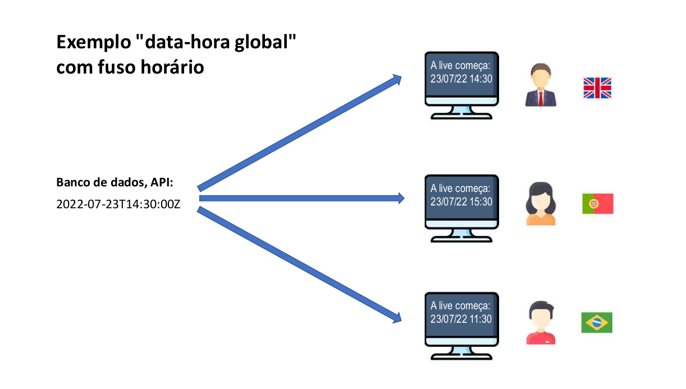

# Tópicos especiais em Java: Data-Hora

## Conceitos importantes
1. **Data-[hora] local:**
    1. ano-mês-dia-[hora] **sem fuso horário**
   2. [hora] opcional
2. Data-hora global
    1. ano-mês-dia-hora **com fuso horário**
3. Duração:
    1. tempo decorrido entre duas data-horas


### Representação de uma data-hora global


Na imagem acima temos a diferença entre as horas em diferentes países. O resultado de
```text
2022-07-23T14:30:00Z
```
O Z no final representa o horário em londres. Por fim, temos o cálculo do sistema local, onde irá exibir a hora em 
cada país.

## Quando usar?
1. Data-[hora] local:
   1. Quando o **momento exato não interessa a pessoa de outro fuso horário.**
   2. Uso comum: sistemas de região única, Excel.
      1. Data de nascimento: "15/06/2001"
      2. Data-hora da venda: "13/08/2022" às 15:32" (presumindo não interessar o fuso horário)
2. Data-hora global:
   1. Quando o **momento exato interessa a pessoa de outro fuso horário.**
   2. Uso comum: sistemas multi-região, web.
      1. Quando será o sorteio? "21/08/2022 às 20h (horário de São Paulo)"
      2. Quando o comentário foi postado? "há 17 minutos"
      3. Quando foi realizada a venda? "13/08/2022 às 15:32 (horario de São Paulo)"
      4. Início e fim do evento? "21/08/2022 às 14h até 16h (horário de São Paulo)"


## Timezone (fuso horário)
1. **GMT - Greenwich Mean Time**
   1. **Horário de Londres**
   2. **Horário do padrão UTC - Coordinated Universal Time**
   3. **Também chamado de "Z" time, ou Zulu time**
2. **Outros fusos horários são relativos ao GMT/UTC:**
   1. **São Paulo: GMT-3**
   2. **Manaus: GMT-4**
   3. **Portugal: GMT+1**
3. **Muitas linguagens/tecnologias usam nomes para as timezones:**
   1. **"US/Pacific"**
   2. **"America/Sao_Paulo"**
   3. **etc.**

## Padrão ISO 8601
Padrão de horas em texto.

1. **Data-[hora] local:**
   1. 2022-07-21
   2. 2022-07-21T14:52
   3. 2022-07-21T14:52:09
   4. 2022-07-21T14:52:09.4073
2. **Data-hora global:**
   1. 2022-07-23T14:52:09Z
   2. 2022-07-23T14:52:09.254935Z
   3. 2022-07-23T14:52:09-03:00


## Operações importantes com data-hora
1. Instanciação
   1. (agora) -> Data-hora
   2. Texto ISO 8601 -> Data-hora
   3. Texto foramto customizado -> Data-hora
   4. dia, mês, ano, [horário] -> Data-hora local
2. Formatação
   1. Data-hora -> Texto ISO 8601
   2. Data-hora -> Texto formato customizado
3. Obter dados de uma data-hora local
   1. Data-hora local -> dia, mês, ano, horário
4. Converter data-hora global para local
   1. Data-hora global, timezone (sistema local) -> Data-hora local
5. Cálculos com data-hora
   1. Data-hora +/- tempo -> Data-hora
   2. Data-hora 1, Data-hora 2 -> Duração

## Principais tipos Java (versão 8+)
1. Data-hora local
   1. LocalDate
   2. LocalDateTime
2. Data-hora global
   1. Instant
3. Duração
   1. Duration
4. Outros
   1. ZoneId
   2. ChronoUnit

## Operações importantes com data-hora
1. Instaciação
   1. (agora) -> Data-hora
   2. Texto ISO 8601 -> Data-hora
   3. Texto formato customizado -> Data-hora
   4. dia, mês, ano, [horário] -> Data-hora local
2. Formatação
   1. Data-hora -> Texto ISO 8601
   2. Data-hora -> Texto formato customizado


### Algumas formas de trabalhar com data-hora em Java

```java
package app;

// API que trabalha com datas
import java.time.Instant;
import java.time.LocalDate;
import java.time.LocalDateTime;
import java.time.format.DateTimeFormatter;

public class Program {
    public static void main(String[] args) {
        // Instaciamos a classe LocalDate usando o método now()
        LocalDate d01 = LocalDate.now();
        // Exibe a data local
        // 2023-01-27
        System.out.println(d01);

        // Insanciamos a classe LocalDateTime pegando o tempo local
        LocalDateTime d02 = LocalDateTime.now();
        // Exibe a data local + horário local
        // 2023-01-27T12:59:01.638310
        System.out.println(d02);

        // Instaciamos a classe Instant usando o método now()
        Instant d03 = Instant.now();
        // Exibe a data e a hora + time zone(Z = Data hora GMT(Londres))
        // 2023-01-27T16:00:31.064068Z
        System.out.println(d03);

        // Criamos uma data usando o modelo ISO 8601
        LocalDate d04 = LocalDate.parse("2023-01-27");
        System.out.println(d04);

        // Criamos uma data usando o modelo ISO 8601
        LocalDateTime d05 = LocalDateTime.parse("2023-01-27T13:30:25");
        System.out.println(d05);

        // A classe DateTimeFormatter disponibiliza o método ofPattern
        // que permite especificar como a data será formatada
        DateTimeFormatter fmt1 = DateTimeFormatter.ofPattern("dd/MM/yyy");
        LocalDate d06 = LocalDate.parse("31/01/2023", fmt1);
        System.out.println(d06);

        // Formatando a saída de uma data
        DateTimeFormatter fmt2 = DateTimeFormatter.ofPattern("dd/MM/yyyy HH:mm");
        LocalDateTime d07 = LocalDateTime.parse("31/01/2023 16:20", fmt2);
        // Resultado: 2023-01-31T16:20
        System.out.println(d07);

        // Método of() permite formatar a saída da data
        LocalDate d08 = LocalDate.of(2023, 01, 31);
        System.out.println(d08);

        LocalDateTime d09 = LocalDateTime.of(2023, 01, 31, 22, 20);
        // Resultado: 2023-01-31T22:20
       System.out.println(d09);
    }
}
```

[Voltar](../README.md)